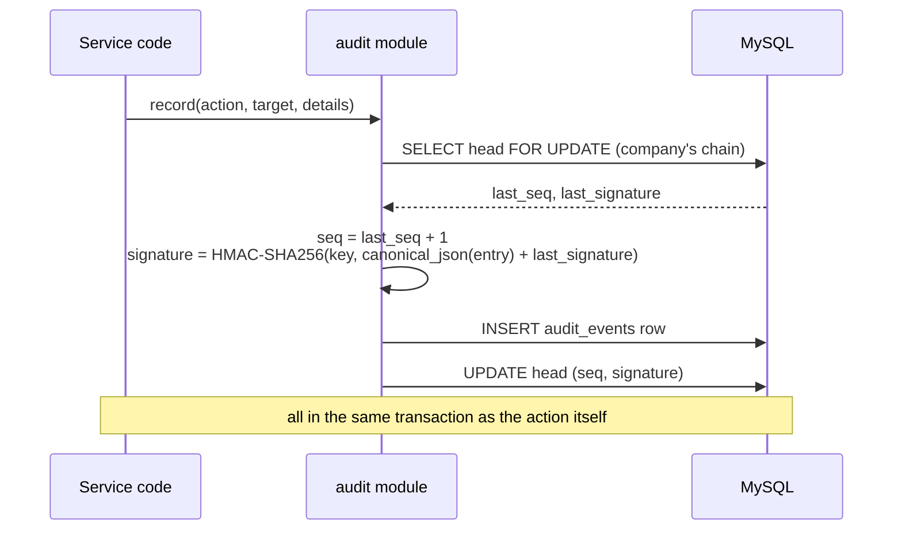

# Audit log

**In short:** every security-relevant action (sign-ins, permission changes, approvals, schedule changes, automatic expirations) is written to a log that cannot be quietly edited. Each entry is linked to the previous one and signed with a secret key that is kept outside the database, so any change, removal, or insertion is detected when the log is checked.

Decision: [0018](https://github.com/workforce-ops-app/.github/blob/main/docs/decisions/0018-audit-log-chains.md).

> **Status:** design. Code references will be added when the audit module is built.

## How an entry is written

- The entry is written **in the same transaction** as the action it records, so an action cannot succeed without its audit entry (and vice versa).
- Each company has its own chain. Actions by platform personnel go to a separate platform chain.
- Automatic actions use actor `system`.

## What an entry contains

| Field | Notes |
|---|---|
| `seq` | 1, 2, 3… per chain, no gaps; `(chain_id, seq)` is a unique key |
| `chain_id` | which log: the company's ID, or the all-zero UUID for the platform chain |
| `company_id` | null for the platform chain |
| `actor_type`, `actor_id` | `user`, `platform_user`, or `system` (no ID for `system`) |
| `action` | dotted name, e.g. `time_off.approved`, `role.permission_added` |
| `target_type`, `target_id` | what was acted on |
| `occurred_at` | UTC |
| `details` | JSON: before/after values where useful. No passwords, tokens, or secrets |
| `key_id` | which signing key was used |
| `prev_signature`, `signature` | the chain links |

**Canonical JSON:** the signed bytes are the entry's fields as JSON with sorted keys, no extra whitespace, UTF-8, and timestamps in one fixed format, so verification always recomputes identical bytes.

## Verification

- **Nightly job:** re-verifies every chain from the start (or from the last verified checkpoint), and records the result as an audit event.
- **On demand:** owners (through a dedicated audit permission) can run verification for their company.
- **Outside copy:** each night the latest head signature per chain is written to the application log, so a database rollback to an older state can also be detected.

A verification failure names the first bad `seq` and raises a security event.

## Protection in the database

| Database user | Audit tables |
|---|---|
| application | `INSERT`, `SELECT` on `audit_events`; `SELECT`, `UPDATE` on `audit_chain_heads` |
| migrations | schema changes only, not used by the running application |

## The signing key

- Provided through the environment or a secret store, **never** stored in the database or the repository.
- Has an ID; rotating the key starts using a new ID while old entries keep theirs. Old keys are kept (read-only) for verification.
- Losing a key means entries signed with it can no longer be verified; leaking it reduces the protection to a plain hash chain. Its handling will be covered by an operations runbook.

## What to log

Log actions that change access, data belonging to others, or configuration: authentication events, role and permission changes, scope changes, approvals and denials, schedule changes, policy changes, support access, and automatic actions. Feature pages list their audit events.
