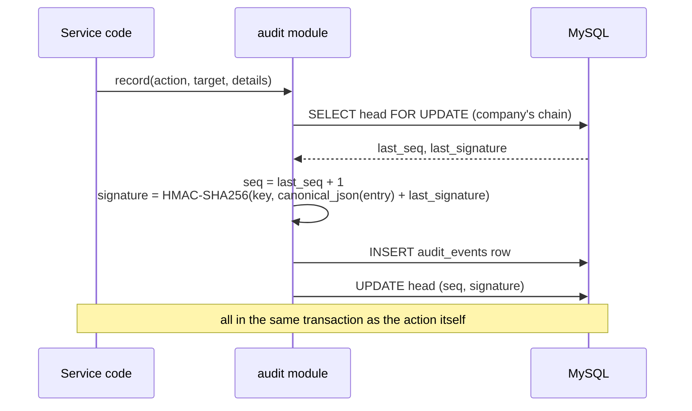

# Audit log

**In short:** every security-relevant action (sign-ins, permission changes, approvals, schedule changes, automatic expirations) is written to a log that cannot be quietly edited. Each entry is linked to the previous one and signed with a secret key that is kept outside the database, so any change, removal, or insertion is detected when the log is checked.

Decision: [0018](https://github.com/workforce-ops-app/.github/blob/main/docs/decisions/0018-audit-log-chains.md).

> **Status:** writing is built (`app/audit/`, migration `0003`, slice L1). Verification and the viewer follow in Phase 4 (#58); insert-only database rights in T2 (#43).

## How an entry is written


```mermaid
sequenceDiagram
    participant S as Service code
    participant A as audit module
    participant DB as MySQL
    S->>A: record(action, target, details)
    A->>DB: SELECT head FOR UPDATE (company's chain)
    DB-->>A: last_seq, last_signature
    A->>A: seq = last_seq + 1<br/>signature = HMAC-SHA256(key, canonical_json(entry) + last_signature)
    A->>DB: INSERT audit_events row
    A->>DB: UPDATE head (seq, signature)
    Note over S,DB: all in the same transaction as the action itself
```

- The entry is written **in the same transaction** as the action it records, so an action cannot succeed without its audit entry (and vice versa).
- Each company has its own chain. Actions by platform personnel go to a separate platform chain.
- Automatic actions use actor `system`.

## Recording an action

```python
from app.audit import Actor, record

record(
    session,
    actor=Actor.user(user_id),
    action="shift.assigned",
    target_type="shift",
    target_id=shift.id,
    details={"employee_id": str(employee_id)},
)
```

| Rule | Why |
|---|---|
| Call it in the **same session** as the action, before the caller commits; `record()` never commits | the action and its entry are saved together or not at all |
| The chain is the **session's company** (`app/tenancy/context.py`); there is no company or chain parameter | one company's actions can never be written into another company's log. A session with no company (platform code) writes to the platform chain; a person's action (`Actor.user`) is refused there |
| `action` is a dotted lowercase name, such as `shift.assigned` | consistent names for the viewer and the detection study |
| `details` holds text, whole numbers, true/false, null, lists, and objects. Keys containing `password`, `token`, `secret`, or `hash` are refused at any depth, and so are decimal numbers and whole numbers beyond 64 bits | the log is kept forever, so it must never hold credentials; MySQL may write such numbers back differently, which would change the signed bytes |
| Without `AUDIT_SIGNING_KEY`, `record()` raises `AuditError` | no unsigned entries: the action fails with it |
| A chain's first entry creates its head | companies need no setup step. If two first entries ever raced, the head's primary key lets only one create it; the other transaction fails and rolls back |

Each feature page lists the audit events its actions write; every slice from L1 on records them.

| Part | Where | What it does |
|---|---|---|
| Tables | `app/audit/models.py`, migration `0003` | `AuditChainHead` and `AuditEvent`, as on the [data model](data-model.md#audit_chain_heads) |
| Signing | `app/audit/signing.py` | `canonical_json(event)` and `sign(key, event, prev_signature)`; verification (#58) reuses them |
| Writing | `app/audit/record.py` | `record()` and `Actor`: checks, locks the head, numbers, signs, and adds the entry |
| Settings | `app/core/config.py` | `AUDIT_SIGNING_KEY` (at least 32 characters) and `AUDIT_KEY_ID` |
| Tests | `tests/unit/test_audit_record.py`, `tests/security/test_audit_log.py` | numbering, links, signatures, rollback; tampering, forgery without the key, secrets in details, and crossing companies |

The audit tables are not `CompanyOwned` (the platform chain has no company), so the tenancy coverage test lists them as its one stated exception. Two consequences for later slices:
- **Reading is not filtered by company.** A query on `AuditEvent` in a company's session would see every company's entries. Nothing reads the log yet; the viewer (#58) must limit every read to the session's chain itself.
- **Details are checked by key name only.** `{"password": ...}` is refused, but a value that happens to contain a secret cannot be recognized, so callers never put credentials into details at all.

## What an entry contains

| Field | Notes |
|---|---|
| `seq` | 1, 2, 3… per chain, no gaps; `(chain_id, seq)` is a unique key |
| `chain_id` | which log: the company's ID, or the all-zero UUID for the platform chain |
| `company_id` | null for the platform chain |
| `actor_type`, `actor_id` | `user`, `platform_user`, or `system` (no ID for `system`) |
| `action` | dotted name, e.g. `time_off.approved`, `role.permission_added` |
| `target_type`, `target_id` | what was acted on |
| `occurred_at` | UTC |
| `details` | JSON: before/after values where useful. No passwords, tokens, or secrets |
| `key_id` | which signing key was used |
| `prev_signature`, `signature` | the chain links |

**Canonical JSON:** the signed bytes are the entry's fields as JSON with sorted keys, no extra whitespace, UTF-8, and timestamps in one fixed format, so verification always recomputes identical bytes.

## Verification

- **Nightly job:** re-verifies every chain from the start (or from the last verified checkpoint), and records the result as an audit event.
- **On demand:** owners (through a dedicated audit permission) can run verification for their company.
- **Outside copy:** each night the latest head signature per chain is written to the application log, so a database rollback to an older state can also be detected.

A verification failure names the first bad `seq` and raises a security event.

## Protection in the database

| Database user | Audit tables |
|---|---|
| application | `INSERT`, `SELECT` on `audit_events`; `INSERT`, `SELECT`, `UPDATE` on `audit_chain_heads` (a chain's first entry creates its head). Never `DELETE` on either |
| migrations | schema changes only, not used by the running application |

These rights arrive with T2 (#43). Until then the application's database user can change rows directly; the signatures make any such change detectable.

## The signing key

- Provided through the environment or a secret store (`AUDIT_SIGNING_KEY`, with its ID in `AUDIT_KEY_ID`), **never** stored in the database or the repository. Locally it goes in `.env`; generate one with `python -c "import secrets; print(secrets.token_urlsafe(32))"`.
- Has an ID; rotating the key starts using a new ID while old entries keep theirs. Old keys are kept (read-only) for verification.
- Losing a key means entries signed with it can no longer be verified; leaking it reduces the protection to a plain hash chain. Its handling will be covered by an operations runbook.

## Why a signed hash chain

**In short:** each entry is linked to the one before it, so changing history breaks the chain, and each link is signed with a secret key, so nobody without the key can repair a broken chain. The accurate name is an **HMAC-signed hash chain**, or a tamper-evident log.

**How the links work:** every entry stores the previous entry's signature, and its own signature covers that value. Editing, removing, or inserting an entry therefore invalidates every entry after it.

**Why a secret key instead of a plain hash:** with a plain hash chain, anyone with database access could change an entry and recompute every hash after it, leaving a chain that still looks valid. Without the key they cannot produce valid signatures. Only whoever holds the key (the verification job, and owners through it) can verify the chain.

**Wording for reports:** describe it as a "tamper-evident, HMAC-signed hash chain".

## What to log

Log actions that change access, data belonging to others, or configuration: authentication events, role and permission changes, scope changes, approvals and denials, schedule changes, policy changes, support access, and automatic actions. Feature pages list their audit events.
