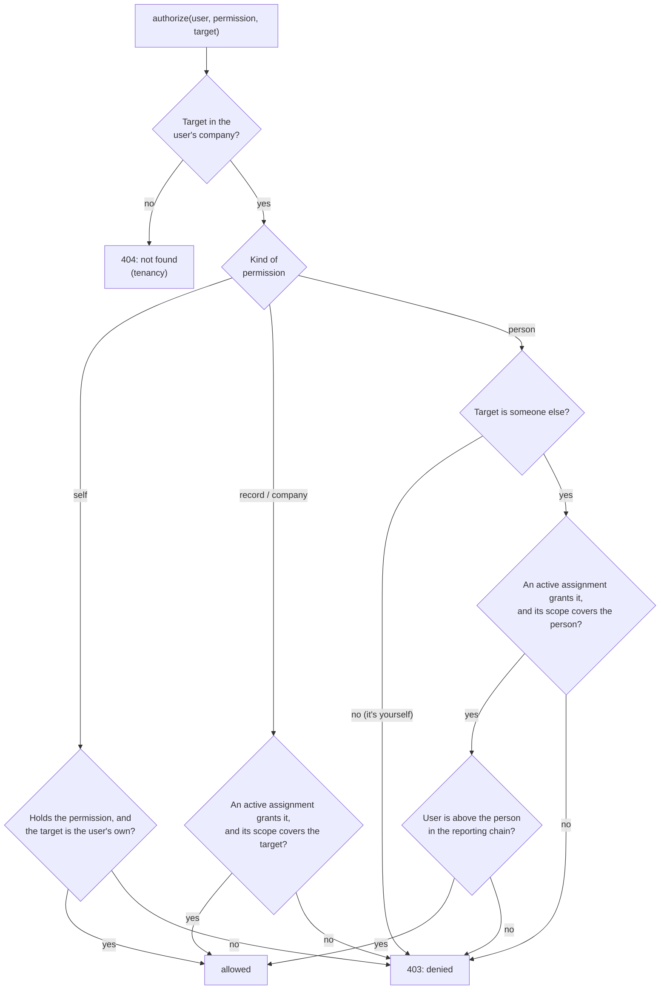

# Authorization

**In short:** every action in the application is a named **permission**, and **roles** bundle permissions. When someone is given a role, the assignment says **where** it applies: the whole company, a department, a team, or one employee. For actions on a person (changing their roles, reviewing their requests, resetting their password), the user must also be **above that person in the reporting chain**. Everything is denied unless a rule allows it, and nobody can change their own access.

Decisions: [0017 scoped role assignments](https://github.com/workforce-ops-app/.github/blob/main/docs/decisions/0017-scoped-role-assignments.md) · [0024 authorization model](https://github.com/workforce-ops-app/.github/blob/main/docs/decisions/0024-authorization-model.md) · [0025 sensitive actions](https://github.com/workforce-ops-app/.github/blob/main/docs/decisions/0025-sensitive-actions-and-security-settings.md) · [0029 approval routing](https://github.com/workforce-ops-app/.github/blob/main/docs/decisions/0029-request-approval-routing.md)

> **Status:** design. Code references will be added when the `authz` layer is built (Phase 2).

## The two questions every check answers

| Question | Answered by | Example |
|---|---|---|
| **What** may this user do? | the permissions in the roles they hold | a Manager role grants `schedule.edit` |
| **Where**, or **on whom**? | for records: the scope of the role assignment; for people: the reporting chain | the Manager role is assigned for the Kitchen department, so they may edit Kitchen shifts; they may review Sam's time off only if they are above Sam |

Company separation comes first and is a different mechanism ([tenancy](tenancy.md)): another company's records do not exist for the user (404). Authorization then decides what is allowed **inside** the user's company (403 when not allowed).

## Permissions

**Naming:** `resource.action`, lowercase. Self-service permissions end in `_self` and only ever apply to the user's own records. Each module declares its permissions in its `permissions.py`, and the registry collects them ([extension points](https://github.com/workforce-ops-app/.github/blob/main/docs/decisions/0012-extensibility-patterns.md)).

**Kinds of permission**, which decide how a check works:

| Kind | Applies to | Checked with |
|---|---|---|
| **Self** | the user's own records | the record belongs to the user |
| **Record** | shifts, requests, and other records | the assignment's scope covers the record |
| **Person** | another person: their roles, account, or requests | the assignment's scope covers the person **and** the user is above them in the reporting chain |
| **Company** | company-wide settings and structure | an assignment with company scope |

**Core permissions** (later features add their own):

| Permission | Kind | Allows |
|---|---|---|
| `schedule.view_self` | self | see your own shifts |
| `schedule.view` | record | see shifts in scope, including open shifts |
| `schedule.edit` | record | create, change, and cancel shifts in scope |
| `time_off.request` | self | ask for time off for yourself |
| `time_off.cancel_self` | self | cancel your own pending or approved request |
| `time_off.view` | record | see time-off requests of people in scope |
| `time_off.review` | person | approve or deny the requests of people you are above ([0029](https://github.com/workforce-ops-app/.github/blob/main/docs/decisions/0029-request-approval-routing.md)) |
| `user.view` | record | see people in scope (name, department, teams, roles) |
| `user.manage` | person | create accounts, issue setup and reset links, deactivate, unlock, sign out |
| `org.manage` | company | create, rename, and archive departments and teams; move people between them |
| `role.view` | company | see roles and what they grant |
| `role.manage` | company | create and archive roles, change what a role grants |
| `role.assign` | person | give or remove a role, with its scope, for people you are above |
| `reporting_line.manage` | person | add or end reporting lines between two people you are both above |
| `settings.manage` | company | change company settings, including security settings |
| `audit.view` | company | read the company's audit log |
| `audit.verify` | company | run verification of the company's audit chain |
| `company.transfer_ownership` | company | add or remove an owner (Owner role only) |

Changing your own password and signing yourself out need no permission; every signed-in user can do both.

## Starting roles

Every new company gets four roles ([0024](https://github.com/workforce-ops-app/.github/blob/main/docs/decisions/0024-authorization-model.md)). Companies may edit all but Owner, and may add their own roles.

| Permission | Owner | Administrator | Manager | Employee |
|---|:---:|:---:|:---:|:---:|
| `schedule.view_self` | yes | yes | yes | yes |
| `schedule.view` | yes | yes | yes | yes (see below) |
| `schedule.edit` | yes | yes | yes | |
| `time_off.request`, `time_off.cancel_self` | yes | yes | yes | yes |
| `time_off.view`, `time_off.review` | yes | yes | yes | |
| `user.view` | yes | yes | yes | |
| `user.manage` | yes | yes | | |
| `org.manage` | yes | yes | | |
| `role.view` | yes | yes | yes | |
| `role.manage`, `role.assign` | yes | yes | | |
| `reporting_line.manage` | yes | yes | | |
| `settings.manage` | yes | yes | | |
| `audit.view`, `audit.verify` | yes | yes | | |
| `company.transfer_ownership` | yes | | | |

- **Typical scopes:** Owner and Administrator are assigned for the whole company; a Manager for their department or team; everyone gets the Employee role scoped to their **home department**, which is what lets employees see their department's schedule. An administrator can remove `schedule.view` from the Employee role to turn that off.
- **Owner** is locked: its permissions cannot be changed, it is always assigned for the whole company, and a company always has at least one owner.
- Later features add to these roles; for example employees do not get `announcement.create` by default.

## How a check works

`authorize(user, permission, target)` is called by every service function before it does anything.



**Scope coverage** ([0017](https://github.com/workforce-ops-app/.github/blob/main/docs/decisions/0017-scoped-role-assignments.md)):

| Assignment scope | Covers |
|---|---|
| company | everything in the company |
| department | the department, its teams, the people whose home department it is, and their records |
| team | the team's members and their records |
| employee | that one person and their records |

Archived roles and deactivated users grant nothing. Permissions are read on every request, so a change to someone's roles takes effect immediately.

### Scope resolvers

`authorize()` does not know what a shift or a request is. Each module registers a **scope resolver** that answers, for one of its records: which department, which team(s), and which employee does it belong to? For a shift: its `department_id` and its `employee_id` (none while open). For a time-off request: its employee, and through them their home department and teams.

### Lists: the scope filter

Checking each row one by one would be slow and easy to forget. For lists, the `authz` layer turns the user's assignments for a permission into a **database condition** that the repository adds to its query, for example "shifts whose department is Kitchen, or whose employee is on the Weekend Crew team". Rows outside scope are never loaded.

## The reporting chain

A `reporting_lines` row says that one person reports to another ([data model](data-model.md#reporting_lines)). Following the lines upwards gives everyone a person is **below**; the **Owner counts as above everyone**.

**Being above someone grants nothing by itself.** It decides *whom* you may act on; your permissions decide *what* you may do. Only **person** permissions use it.

**Finding out whether A is above B** walks the lines upwards from B with a recursive query. In SQL it looks like this (the code builds it with SQLAlchemy's `cte(recursive=True)`, never as a hand-written string, per [0022](https://github.com/workforce-ops-app/.github/blob/main/docs/decisions/0022-sqlalchemy-and-alembic.md)):

```sql
WITH RECURSIVE above_b (manager_id) AS (
    SELECT manager_id FROM reporting_lines
     WHERE employee_id = :b AND company_id = :company AND ended_at IS NULL
    UNION
    SELECT r.manager_id FROM reporting_lines r
      JOIN above_b a ON r.employee_id = a.manager_id
     WHERE r.company_id = :company AND r.ended_at IS NULL
)
SELECT 1 FROM above_b WHERE manager_id = :a;
```

The first `SELECT` finds B's direct managers; the second repeatedly joins "the managers of the people found so far". `UNION` (not `UNION ALL`) drops duplicates, so the walk also stops if a loop ever slipped in.

**Rules for reporting lines** ([0024](https://github.com/workforce-ops-app/.github/blob/main/docs/decisions/0024-authorization-model.md)):
- Adding or ending a line needs `reporting_line.manage` and a position above **both** people. The Owner can always do it.
- Nobody adds or ends a line they are part of.
- A line may not create a loop: the new manager must not already be below the employee. Nobody reports to themselves.
- Only one current line per manager and employee pair.
- Adding or ending a line needs the password re-entered and is audited.

**People with no line above them** can be managed only by the Owner. Their requests go straight to the Owner ([0029](https://github.com/workforce-ops-app/.github/blob/main/docs/decisions/0029-request-approval-routing.md)).

## Escalation rules

Each rule becomes a security test in `tests/security/` when the code is built. The IDs match the [threat model](../security/threat-model.md).

| # | Rule | Threat |
|---|---|---|
| AZ1 | Nobody changes their own role assignments. | E1 |
| AZ2 | Nobody adds or ends a reporting line they are part of. | E1, E4 |
| AZ3 | Nobody grants a permission they do not hold themselves, whether by editing a role or by assigning one. | E2 |
| AZ4 | Nobody assigns a role with a scope wider than their own for that role's permissions (a department manager cannot assign a company-wide role). | E2 |
| AZ5 | Acting on a person (roles, account, requests) needs a position above them; peers and superiors are refused, even with the permission. | E3 |
| AZ6 | Adding or ending a reporting line needs a position above both people; loops and self-reporting are rejected. | E4 |
| AZ7 | Nobody reviews their own request. | E5 |
| AZ8 | The last owner cannot be removed, demoted, or deactivated; owners are added and removed only through ownership transfer. | E6 |
| AZ9 | The Owner role's permissions cannot be changed. | E6 |
| AZ10 | Security settings can only be made stricter, within platform limits. | E7 |
| AZ11 | Every endpoint enforces its permission on the server, whatever the interface shows. | E8 |
| AZ12 | Every role, permission, assignment, reporting line, and ownership change writes an audit entry. | R1 |

## Sensitive actions

These need the password re-entered shortly before, as set out in [0025](https://github.com/workforce-ops-app/.github/blob/main/docs/decisions/0025-sensitive-actions-and-security-settings.md) (how re-entry works is on the [authentication](authentication.md) page):

- adding or removing an owner (ownership transfer);
- **admin-level changes**: assigning or removing a role that includes any of `user.manage`, `role.manage`, `role.assign`, `reporting_line.manage`, or `settings.manage`, and deactivating someone who holds such a role;
- changing what a role grants;
- adding or ending a reporting line;
- changing security settings.

Schedule changes affecting 10 or more shifts show a confirmation with the count (no password re-entry). Companies may add actions to the re-entry list but never remove them.

## Audit events

| Action | When |
|---|---|
| `role.created`, `role.renamed`, `role.archived` | a role is created, renamed, or archived |
| `role.permission_added`, `role.permission_removed` | what a role grants changes |
| `role_assignment.added`, `role_assignment.removed` | someone gains or loses a role (details: scope) |
| `reporting_line.added`, `reporting_line.ended` | a reporting line starts or ends |
| `ownership.owner_added`, `ownership.owner_removed` | ownership transfer |

Refused requests (403) are not audit entries: they are recorded as security events for detection (next tier), with the permission and the kind of target, never the record's contents.

## What the interface gets

The session endpoint returns the signed-in user's effective permissions, so the interface can build its menu and hide buttons the user cannot use ([permission-driven navigation](https://github.com/workforce-ops-app/.github/blob/main/docs/decisions/0012-extensibility-patterns.md)). This is a convenience only; the API checks every request (AZ11).

## Where the code lives

| Part | Location |
|---|---|
| Permission registry, `authorize()`, scope filter, reporting chain queries | `app/authz/` |
| A module's permissions | `app/modules/<feature>/permissions.py` |
| A module's scope resolver | registered by the module at startup |
| Escalation tests | `tests/security/` |
