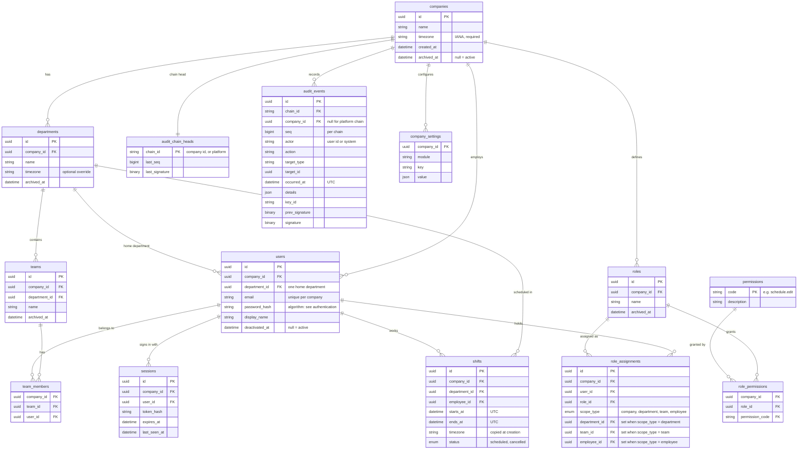

# Data model

**In short:** the tables every feature builds on: companies and their structure, people, roles and where they apply, sessions, and the audit log. Every company-owned row carries its company, records are deactivated or archived rather than deleted, IDs are UUIDv7, and exact moments are stored in UTC.

Decisions behind this page: [0016 tenancy](https://github.com/workforce-ops-app/.github/blob/main/docs/decisions/0016-tenant-isolation.md) · [0017 scoped roles](https://github.com/workforce-ops-app/.github/blob/main/docs/decisions/0017-scoped-role-assignments.md) · [0018 audit](https://github.com/workforce-ops-app/.github/blob/main/docs/decisions/0018-audit-log-chains.md) · [0019 IDs](https://github.com/workforce-ops-app/.github/blob/main/docs/decisions/0019-uuidv7-ids.md) · [0020 deletion](https://github.com/workforce-ops-app/.github/blob/main/docs/decisions/0020-status-over-deletion.md) · [0021 time](https://github.com/workforce-ops-app/.github/blob/main/docs/decisions/0021-time-handling.md) · [0022 SQLAlchemy](https://github.com/workforce-ops-app/.github/blob/main/docs/decisions/0022-sqlalchemy-and-alembic.md)

> **Status:** design. Tables are created when the features that need them are built. Feature tables (time off, coverage and swaps, tasks, announcements, notifications) are documented on their feature pages.

## Core tables

`shifts` appears here because roles, tenancy, and audit all refer to it. Its full rules are documented with the schedules feature.

## Conventions for every table

| Convention | Rule |
|---|---|
| **Primary keys** | `id BINARY(16)` holding a UUIDv7, generated in the application; exposed in the API as a hyphenated string |
| **Company ownership** | Company-owned tables have `company_id NOT NULL`, a unique key on `(company_id, id)`, and composite foreign keys `(company_id, <x>_id)` → `<x>(company_id, id)`. See [tenancy](tenancy.md) |
| **Global tables** | Only `permissions` (the permission catalogue, maintained by code) and platform tables are not company-owned |
| **Timestamps** | `created_at` and `updated_at`, `DATETIME(6)` in UTC, on every table |
| **Deletion** | No hard deletes of business records. Users get `deactivated_at`; structure (companies, departments, teams, roles) gets `archived_at`; workflow records get an explicit `status`. Default queries exclude inactive rows |
| **Moments vs dates** | Moments are UTC `DATETIME(6)`; calendar days (time off, holidays) are `DATE` in the workplace's zone |
| **Enumerations** | Stored as short strings with a `CHECK` constraint, mirrored by Python enums |
| **Names** | Tables plural `snake_case`; foreign keys `<singular>_id` |

## Structure rules

- Each **team** belongs to exactly one department.
- Each **user** has exactly one home department and can be on several teams in the company.
- A user belongs to exactly **one company**. Platform personnel are stored in separate platform tables.
- `role_assignments` has a `CHECK` that exactly the column matching `scope_type` is set, and none for `company`.

## Time zones

- The **workplace zone** for a shift is the department's `timezone` if set, otherwise the company's.
- When a shift is created, that zone is copied into `shifts.timezone`, so later settings changes or daylight-saving rules never move existing shifts.
- Deadlines ("no swaps within 24 hours of the shift") are computed in UTC.

## Retention

| Data | Kept |
|---|---|
| Audit log | indefinitely |
| Security events | 1 year |
| Sessions | until expiry, then removed |
| One-time tokens | until used or expired, then removed |

## Adding a table

1. Decide whether it is company-owned (almost always yes). If so, follow the company-ownership convention above and register the model with the tenant filter (the coverage test fails otherwise).
2. Choose status fields rather than deletion.
3. Add the migration in the same PR as the feature: one migration per PR.
4. Document it on the feature's page; add it to the diagram above only if other features depend on it.
