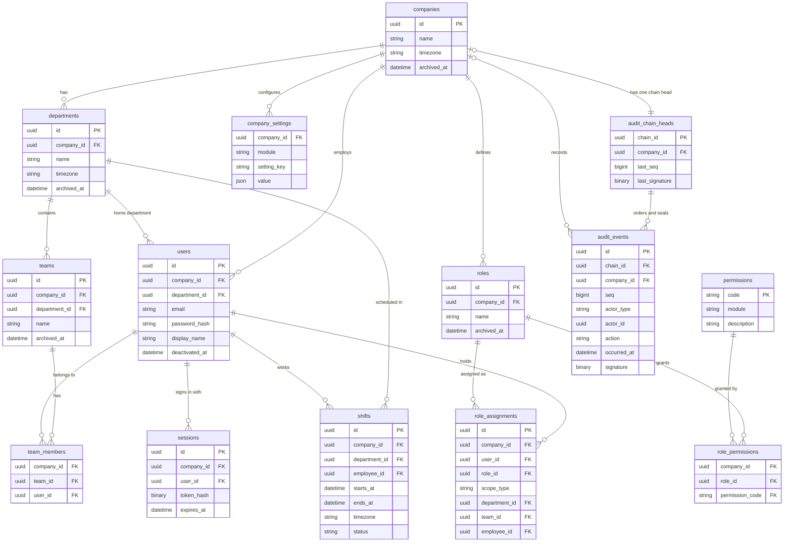

# Data model

**In short:** the tables every feature builds on: companies and their structure, people, roles and where they apply, sessions, shifts, company settings, and the audit log. Every company-owned row carries its company, records are deactivated or archived rather than deleted, IDs are UUIDv7, and exact moments are stored in UTC.

Decisions behind this page: [0016 tenancy](https://github.com/workforce-ops-app/.github/blob/main/docs/decisions/0016-tenant-isolation.md) · [0017 scoped roles](https://github.com/workforce-ops-app/.github/blob/main/docs/decisions/0017-scoped-role-assignments.md) · [0018 audit](https://github.com/workforce-ops-app/.github/blob/main/docs/decisions/0018-audit-log-chains.md) · [0019 IDs](https://github.com/workforce-ops-app/.github/blob/main/docs/decisions/0019-uuidv7-ids.md) · [0020 deletion](https://github.com/workforce-ops-app/.github/blob/main/docs/decisions/0020-status-over-deletion.md) · [0021 time](https://github.com/workforce-ops-app/.github/blob/main/docs/decisions/0021-time-handling.md) · [0022 SQLAlchemy](https://github.com/workforce-ops-app/.github/blob/main/docs/decisions/0022-sqlalchemy-and-alembic.md)

> **Status:** design. Tables are created when the features that need them are built. Feature tables (time off, coverage and swaps, tasks, announcements, notifications) are documented on their feature pages.

**How to read this page:** the [diagram](#overview-diagram) is a summary. The [entities](#entities) and [relationships](#relationships) sections are the detailed, authoritative version. A change to a table updates all three (see [adding a table](#adding-a-table)).

## Overview diagram

---

## Entities

Every table also has `created_at` and `updated_at` (`DATETIME(6)`, UTC); they are not repeated below. "Company-aware foreign key" means the reference includes `company_id`, so it can only point at a row of the same company ([tenancy](tenancy.md)).

### companies

**What it is:** one customer organization (a *tenant*). Everything else belongs to exactly one company.

| Column | Type | Rules |
|---|---|---|
| `id` | `BINARY(16)` | primary key, UUIDv7 |
| `name` | `VARCHAR(200)` | required |
| `timezone` | `VARCHAR(64)` | required; IANA zone name, e.g. `America/Chicago` |
| `archived_at` | `DATETIME(6)` | null = active |

Not itself company-owned. Only platform code creates or archives companies.

### departments

**What it is:** a part of a company, such as Kitchen or Front of House. Every employee has one home department.

| Column | Type | Rules |
|---|---|---|
| `id` | `BINARY(16)` | primary key |
| `company_id` | `BINARY(16)` | required; references `companies` |
| `name` | `VARCHAR(120)` | required; unique within the company |
| `timezone` | `VARCHAR(64)` | optional; overrides the company's zone for this department |
| `archived_at` | `DATETIME(6)` | null = active |

### teams

**What it is:** a smaller group inside one department, such as the Weekend Crew. People can be on several teams.

| Column | Type | Rules |
|---|---|---|
| `id` | `BINARY(16)` | primary key |
| `company_id` | `BINARY(16)` | required |
| `department_id` | `BINARY(16)` | required; company-aware foreign key to `departments` |
| `name` | `VARCHAR(120)` | required; unique within the department |
| `archived_at` | `DATETIME(6)` | null = active |

### users

**What it is:** a person who can sign in: an employee, manager, administrator, or owner of one company. Platform staff are stored separately.

| Column | Type | Rules |
|---|---|---|
| `id` | `BINARY(16)` | primary key |
| `company_id` | `BINARY(16)` | required |
| `department_id` | `BINARY(16)` | required; company-aware foreign key to `departments` (home department) |
| `email` | `VARCHAR(254)` | required; unique within the company |
| `password_hash` | `VARCHAR(255)` | required; algorithm decided with authentication |
| `display_name` | `VARCHAR(120)` | required |
| `deactivated_at` | `DATETIME(6)` | null = active; deactivated users cannot sign in |

### team_members

**What it is:** who is on which team.

| Column | Type | Rules |
|---|---|---|
| `company_id` | `BINARY(16)` | required |
| `team_id` | `BINARY(16)` | company-aware foreign key to `teams` |
| `user_id` | `BINARY(16)` | company-aware foreign key to `users` |

Primary key: `(team_id, user_id)`. Being on a team does not change a person's home department.

### roles

**What it is:** a named set of permissions a company defines, such as Manager or Scheduler.

| Column | Type | Rules |
|---|---|---|
| `id` | `BINARY(16)` | primary key |
| `company_id` | `BINARY(16)` | required |
| `name` | `VARCHAR(80)` | required; unique within the company |
| `archived_at` | `DATETIME(6)` | null = active; archived roles grant nothing |

Which roles a new company starts with is part of the authorization design.

### permissions

**What it is:** the list of every action the application can check, such as `schedule.edit`. It is the same for all companies and is maintained by the code: each module declares its own.

| Column | Type | Rules |
|---|---|---|
| `code` | `VARCHAR(100)` | primary key; naming scheme decided with authorization |
| `module` | `VARCHAR(50)` | the module that declares it |
| `description` | `VARCHAR(255)` | plain-language meaning |

Global, not company-owned. Companies cannot add permissions; they only choose which ones each role grants.

### role_permissions

**What it is:** which permissions each role grants.

| Column | Type | Rules |
|---|---|---|
| `company_id` | `BINARY(16)` | required |
| `role_id` | `BINARY(16)` | company-aware foreign key to `roles` |
| `permission_code` | `VARCHAR(100)` | foreign key to `permissions` |

Primary key: `(role_id, permission_code)`.

### role_assignments

**What it is:** gives a person a role **and says where it applies**: the whole company, one department, one team, or one employee ([0017](https://github.com/workforce-ops-app/.github/blob/main/docs/decisions/0017-scoped-role-assignments.md)).

| Column | Type | Rules |
|---|---|---|
| `id` | `BINARY(16)` | primary key |
| `company_id` | `BINARY(16)` | required |
| `user_id` | `BINARY(16)` | company-aware foreign key to `users` (who holds the role) |
| `role_id` | `BINARY(16)` | company-aware foreign key to `roles` |
| `scope_type` | `VARCHAR(12)` | one of `company`, `department`, `team`, `employee` |
| `department_id` | `BINARY(16)` | set only when `scope_type = department` |
| `team_id` | `BINARY(16)` | set only when `scope_type = team` |
| `employee_id` | `BINARY(16)` | set only when `scope_type = employee`; company-aware foreign key to `users` |

A `CHECK` constraint ensures exactly the column matching `scope_type` is filled in, and none for `company`. The service rejects duplicate assignments.

### sessions

**What it is:** a signed-in browser. Deleting the row signs that browser out.

| Column | Type | Rules |
|---|---|---|
| `id` | `BINARY(16)` | primary key |
| `company_id` | `BINARY(16)` | required |
| `user_id` | `BINARY(16)` | company-aware foreign key to `users` |
| `token_hash` | `BINARY(32)` | hash of the session token; the token itself is never stored |
| `expires_at` | `DATETIME(6)` | required |
| `last_seen_at` | `DATETIME(6)` | for idle timeouts |

Lifetimes, idle timeouts, and cookie details are part of the API conventions. Expired rows are deleted.

### shifts

**What it is:** one scheduled block of work for one employee. Listed here because roles, tenancy, and the audit log refer to it; its full rules are on the schedules feature page.

| Column | Type | Rules |
|---|---|---|
| `id` | `BINARY(16)` | primary key |
| `company_id` | `BINARY(16)` | required |
| `department_id` | `BINARY(16)` | company-aware foreign key to `departments` |
| `employee_id` | `BINARY(16)` | company-aware foreign key to `users` |
| `starts_at`, `ends_at` | `DATETIME(6)` | UTC; `CHECK (ends_at > starts_at)` |
| `timezone` | `VARCHAR(64)` | the workplace zone at creation, copied and never recalculated |
| `status` | `VARCHAR(12)` | `scheduled` or `cancelled` |

### company_settings

**What it is:** a company's choices for configurable rules, such as how many hours before a shift a swap must be requested. Each module declares its settings, their types, and their defaults.

| Column | Type | Rules |
|---|---|---|
| `company_id` | `BINARY(16)` | required; references `companies` |
| `module` | `VARCHAR(50)` | the module that declares the setting |
| `setting_key` | `VARCHAR(80)` | setting name within the module |
| `value` | `JSON` | validated against the module's declared type |

Primary key: `(company_id, module, setting_key)`. A missing row means "use the default".

### audit_chain_heads

**What it is:** a bookmark for each audit log, recording where it currently ends. There is one per company plus one for the platform. Adding an entry locks this row, so two entries can never take the same number ([audit log](audit-log.md)).

| Column | Type | Rules |
|---|---|---|
| `chain_id` | `BINARY(16)` | primary key; the company's ID, or the all-zero UUID for the platform chain |
| `company_id` | `BINARY(16)` | the owning company; null for the platform chain; unique |
| `last_seq` | `BIGINT` | number of the newest entry (0 before the first) |
| `last_signature` | `BINARY(32)` | signature of the newest entry (32 zero bytes before the first) |

The application's database user may only read and update rows here, never delete them.

### audit_events

**What it is:** the audit log itself. One row per recorded action, only ever added, never changed or removed. Each entry is sealed together with the previous entry's seal, so tampering is detectable ([0018](https://github.com/workforce-ops-app/.github/blob/main/docs/decisions/0018-audit-log-chains.md)).

| Column | Type | Rules |
|---|---|---|
| `id` | `BINARY(16)` | primary key |
| `chain_id` | `BINARY(16)` | required; foreign key to `audit_chain_heads` |
| `company_id` | `BINARY(16)` | the company; null for the platform chain |
| `seq` | `BIGINT` | 1, 2, 3… within the chain, no gaps; `(chain_id, seq)` is unique |
| `actor_type` | `VARCHAR(16)` | `user`, `platform_user`, or `system` |
| `actor_id` | `BINARY(16)` | who acted; null when `actor_type = system` |
| `action` | `VARCHAR(100)` | dotted name, e.g. `time_off.approved` |
| `target_type` | `VARCHAR(50)` | what kind of record was acted on |
| `target_id` | `BINARY(16)` | which record |
| `occurred_at` | `DATETIME(6)` | UTC |
| `details` | `JSON` | extra facts; never passwords, tokens, or secrets |
| `key_id` | `VARCHAR(40)` | which signing key sealed this entry |
| `prev_signature` | `BINARY(32)` | the previous entry's signature |
| `signature` | `BINARY(32)` | HMAC-SHA256 over this entry plus `prev_signature` |

The application's database user may only insert and read rows here.

---

## Relationships

| From | To | How many | Enforced by | Meaning |
|---|---|---|---|---|
| companies | departments | one to many | foreign key | A company is divided into departments |
| departments | teams | one to many | company-aware foreign key | Every team sits inside exactly one department |
| companies | users | one to many | foreign key | A person's account belongs to exactly one company |
| departments | users | one to many | company-aware foreign key | Every user has exactly one home department |
| teams ↔ users | via team_members | many to many | company-aware foreign keys | People can be on several teams; teams have many people |
| companies | roles | one to many | foreign key | Each company defines its own roles |
| roles ↔ permissions | via role_permissions | many to many | company-aware FK to roles; FK to permissions | A role grants a set of permissions |
| users | role_assignments | one to many | company-aware foreign key | A person can hold several roles |
| roles | role_assignments | one to many | company-aware foreign key | A role can be given to many people |
| role_assignments | departments / teams / users (scope) | many to one, only one of them | company-aware foreign keys + `CHECK` | Where the role applies: a department, a team, one employee, or (none set) the whole company |
| users | sessions | one to many | company-aware foreign key | A person can be signed in on several browsers |
| departments | shifts | one to many | company-aware foreign key | A shift happens in one department |
| users | shifts | one to many | company-aware foreign key | A shift is worked by one employee |
| companies | company_settings | one to many | foreign key | A company's configured rules |
| companies | audit_chain_heads | one to one | foreign key + unique `company_id` | Each company has exactly one audit log bookmark; the platform's bookmark has no company |
| audit_chain_heads | audit_events | one to many | foreign key + unique `(chain_id, seq)` | Every entry belongs to one log, in numbered order |
| companies | audit_events | one to many (optional) | foreign key | Lets the company filter show each company only its own entries |

---

## Conventions for every table

| Convention | Rule |
|---|---|
| **Primary keys** | `id BINARY(16)` holding a UUIDv7, generated in the application; exposed in the API as a hyphenated string |
| **Company ownership** | Company-owned tables have `company_id NOT NULL`, a unique key on `(company_id, id)`, and composite foreign keys `(company_id, <x>_id)` → `<x>(company_id, id)`. See [tenancy](tenancy.md) |
| **Global tables** | Only `permissions` (maintained by code), `companies`, and platform tables are not company-owned |
| **Timestamps** | `created_at` and `updated_at`, `DATETIME(6)` in UTC, on every table |
| **Deletion** | No hard deletes of business records. Users get `deactivated_at`; structure (companies, departments, teams, roles) gets `archived_at`; workflow records get an explicit `status`. Default queries exclude inactive rows |
| **Moments vs dates** | Moments are UTC `DATETIME(6)`; calendar days (time off, holidays) are `DATE` in the workplace's zone |
| **Enumerations** | Stored as short strings with a `CHECK` constraint, mirrored by Python enums |
| **Names** | Tables plural `snake_case`; foreign keys `<singular>_id` |

## Time zones

- The **workplace zone** for a shift is the department's `timezone` if set, otherwise the company's.
- When a shift is created, that zone is copied into `shifts.timezone`, so later settings changes or daylight-saving rules never move existing shifts.
- Deadlines ("no swaps within 24 hours of the shift") are computed in UTC.

## Retention

| Data | Kept |
|---|---|
| Audit log | indefinitely |
| Security events | 1 year |
| Sessions | until expiry, then removed |
| One-time tokens | until used or expired, then removed |

## Adding a table

1. Decide whether it is company-owned (almost always yes). If so, follow the company-ownership convention and register the model with the tenant filter (the coverage test fails otherwise).
2. Choose status fields rather than deletion.
3. Add the migration in the same PR as the feature: one migration per PR.
4. Document it on the feature's page with the same **entity** and **relationships** format used here. Core tables that other features depend on belong on this page instead.
5. **Keep the three views in sync:** a PR that adds or changes a table on this page updates its entity section, the relationships table, and the diagram together.
