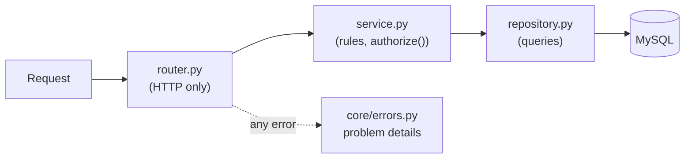

# Layers and modules

**In short:** the backend is one Python package, `app`. Shared building blocks (settings, logging, errors, and later sign-in, permissions, company separation, and the audit log) live in their own folders; every feature lives in its own folder under `app/modules/` and is found automatically. Adding a feature means adding a folder, never editing the shared code.

Decisions: [0004 feature modules](https://github.com/workforce-ops-app/.github/blob/main/docs/decisions/0004-backend-feature-modules.md) · [0012 extension points](https://github.com/workforce-ops-app/.github/blob/main/docs/decisions/0012-extensibility-patterns.md)

> **Status:** partly built. `app/main.py`, `app/core/` (settings, logging, errors), `app/db/` (database connection, base model, migrations), `app/tenancy/` (the company filter), the health module, and the tables of the org module (`app/modules/org/models.py`) exist; the other shared layers arrive in Phase 2.

## The package

```
app/
├── main.py          create_app(): builds the app, registers error handlers, discovers modules
├── core/            config.py (settings), logging.py (JSON logs), errors.py (problem details)
├── db/              session.py (engine, one session per request), base.py (base model), types.py (IDs)
├── auth/            sign-in, sessions, CSRF, password re-entry (Phase 2)
├── authz/           permissions, scopes, reporting chain, authorize() (Phase 2)
├── tenancy/         context.py (the session's company), filter.py (CompanyOwned and the automatic company filter)
├── audit/           the signed audit log (Phase 2)
└── modules/<feature>/
    ├── router.py       HTTP only: paths, status codes, request and response models
    ├── schemas.py      request and response shapes
    ├── service.py      business rules; calls authorize()
    ├── repository.py   the only code that talks to the database
    ├── models.py       tables
    └── permissions.py  the permissions this module declares
```

## How a request flows



- The **router** turns HTTP into function calls and back; it holds no business rules.
- The **service** decides what is allowed and what happens.
- The **repository** is the only place with database queries, so security review knows where to look for SQL.
- **Errors** anywhere become one response format ([0026](https://github.com/workforce-ops-app/.github/blob/main/docs/decisions/0026-api-conventions.md)): RFC 9457 problem details, never a stack trace.

## How modules are found

`create_app()` looks at every package in `app/modules/`. If it has a `router.py` with a variable named `router` (an `APIRouter`), that router is included. No list to edit, so two pull requests adding two modules never conflict on a shared file.

A package without a `router.py` is simply skipped. But if a `router.py` exists and one of its own imports is missing (a typo, or a package that is not installed), the app refuses to start. Skipping it instead would start the server without that feature's endpoints while the health check still said everything was fine.

## Adding an endpoint

In the feature's `router.py`, one function per method and path. Type hints are the validation rules: FastAPI checks every request against them before the function runs, and anything that does not fit becomes a 422 automatically.

```python
router = APIRouter(prefix="/api/notes", tags=["notes"])


class NoteIn(BaseModel):  # request body shape (schemas.py)
    title: str = Field(min_length=1, max_length=100)


@router.get("/{note_id}")  # path parameter
def get_note(note_id: int) -> NoteOut: ...


@router.get("")  # query parameter: ?pinned=true
def list_notes(pinned: bool | None = None) -> list[NoteOut]: ...


@router.post("", status_code=201)  # JSON body, 201 Created
def create_note(note: NoteIn) -> NoteOut: ...
```

| Method | Use for | Usual status |
|---|---|---|
| `GET` | reading; never changes anything | 200 |
| `POST` | creating, or an action such as `/approve` | 201 or 200 |
| `PATCH` | changing some fields | 200 |

## The database layer

Decisions: [0019 IDs](https://github.com/workforce-ops-app/.github/blob/main/docs/decisions/0019-uuidv7-ids.md) · [0021 time](https://github.com/workforce-ops-app/.github/blob/main/docs/decisions/0021-time-handling.md) · [0022 SQLAlchemy and Alembic](https://github.com/workforce-ops-app/.github/blob/main/docs/decisions/0022-sqlalchemy-and-alembic.md) · [0034 driver and ID library](https://github.com/workforce-ops-app/.github/blob/main/docs/decisions/0034-database-driver-ids-and-local-layout.md)

- **Connection** (`app/db/session.py`): one engine for the whole app, created on first use from the `DATABASE_URL` setting (SQLAlchemy 2 with the PyMySQL driver). It keeps a pool of connections and checks each one is alive before use. Each request gets its own session through the `get_session` dependency; FastAPI closes it when the request ends.
- **Base model** (`app/db/base.py`): every model inherits from `Base`, and Alembic reads `Base.metadata` to know the tables. Before that, `import_all_models()` (`app/db/registry.py`) imports every feature's `models.py`; a feature without one is skipped, but a `models.py` that fails to import stops Alembic with the error, so a migration is never generated from an incomplete list of tables (the same rule as router discovery). `IdAndTimestamps` adds the columns every table has:

  | Column | MySQL type | Filled in by |
  |---|---|---|
  | `id` | `BINARY(16)`, primary key | `new_id()`: a UUIDv7, when the row is first saved |
  | `created_at` | `DATETIME(6)` (microseconds) | `utcnow()`, when the row is first saved; never changes |
  | `updated_at` | `DATETIME(6)` | `utcnow()`, when the row is first saved and on every change |

- **IDs** (`app/db/types.py`): `UUIDBinary` turns a Python `uuid.UUID` into its 16 raw bytes on the way into MySQL, and back on the way out; `NULL` stays `None`. UUIDv7 starts with the current time, so new rows go at the end of the primary-key index, and the rest is random, so IDs cannot be guessed (threat model I3). The API shows IDs in the usual hyphenated text form.
- **Times:** every stored moment is UTC. MySQL `DATETIME` holds no time zone, so `utcnow()` takes the current moment in UTC and then removes the zone label; times are converted to local time only for display.
- **Queries** live only in `repository.py` files, so security review knows where to look for SQL. They go through SQLAlchemy, which sends every value as a bound parameter, never as part of the SQL text (threat model T1). The automatic company filter is added in Phase 2 ([tenancy](tenancy.md)).
- **Migrations** (`migrations/`, Alembic) are the versioned scripts that create and change tables. Each has an `upgrade()` that applies the change and a `downgrade()` that undoes it, and points to the one before it (`down_revision`), so they form one line. The first, `0001_baseline`, creates nothing; tables arrive with the features that need them. One migration per pull request; commands are in the [contributor docs](../contributing/README.md#database-and-migrations).

How a model becomes a table:

```python
class Note(IdAndTimestamps, Base):
    __tablename__ = "notes"

    title: Mapped[str] = mapped_column(String(100))
```

```sql
CREATE TABLE notes (
    title VARCHAR(100) NOT NULL,
    id BINARY(16) NOT NULL,
    created_at DATETIME(6) NOT NULL,
    updated_at DATETIME(6) NOT NULL,
    PRIMARY KEY (id)
)
```

A column is `NOT NULL` unless its type allows `None` (`Mapped[str | None]`).

## Errors: raising and adding types

- Raise `HTTPException(status_code, detail)` for a known problem (`404`, `403`, `409`, ...). The handler in `core/errors.py` turns every one of them into problem details ([errors and status codes](../user/errors.md)).
- FastAPI picks the **most specific** registered handler: validation errors go to the 422 handler and HTTP errors to the HTTP handler. Both keep the exception's headers (such as `Allow` on a 405).
- Anything else reaches `UnexpectedErrorMiddleware`, the 500 catch-all. It is middleware, not an exception handler, because Starlette re-raises an exception after its 500 handler runs and uvicorn then logs the full message. The middleware logs a safe line (an `error_id`, the error type, and file and line only) and does not raise again. Full messages and stack traces are logged only when `APP_ENV=development` ([errors](../user/errors.md#what-the-server-log-keeps)).
- **Adding an error type** (for example `NotFoundError` raised by a service, so services need not know about HTTP): define the exception class in `core/errors.py`, write a handler that returns the matching problem response, and register it in `register_error_handlers`.

## Running it

```
uvicorn app.main:create_app --factory --reload
```

Then open http://localhost:8000/api/health. In development the interactive API docs are at http://localhost:8000/api/docs; they are switched off in production, so a production server does not advertise its endpoints.
