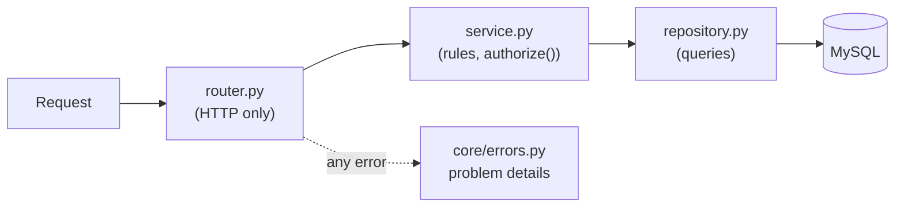

# Layers and modules

**In short:** the backend is one Python package, `app`. Shared building blocks (settings, logging, errors, and later sign-in, permissions, company separation, and the audit log) live in their own folders; every feature lives in its own folder under `app/modules/` and is found automatically. Adding a feature means adding a folder, never editing the shared code.

Decisions: [0004 feature modules](https://github.com/workforce-ops-app/.github/blob/main/docs/decisions/0004-backend-feature-modules.md) · [0012 extension points](https://github.com/workforce-ops-app/.github/blob/main/docs/decisions/0012-extensibility-patterns.md)

> **Status:** partly built. `app/main.py`, `app/core/` (settings, logging, errors), and the health module exist; the other shared layers arrive in Phase 2.

## The package

```
app/
├── main.py          create_app(): builds the app, registers error handlers, discovers modules
├── core/            config.py (settings), logging.py (JSON logs), errors.py (problem details)
├── db/              engine, session, base model (Phase 1, database slice)
├── auth/            sign-in, sessions, CSRF, password re-entry (Phase 2)
├── authz/           permissions, scopes, reporting chain, authorize() (Phase 2)
├── tenancy/         the automatic company filter (Phase 2)
├── audit/           the signed audit log (Phase 2)
└── modules/<feature>/
    ├── router.py       HTTP only: paths, status codes, request and response models
    ├── schemas.py      request and response shapes
    ├── service.py      business rules; calls authorize()
    ├── repository.py   the only code that talks to the database
    ├── models.py       tables
    └── permissions.py  the permissions this module declares
```

## How a request flows



- The **router** turns HTTP into function calls and back; it holds no business rules.
- The **service** decides what is allowed and what happens.
- The **repository** is the only place with database queries, so security review knows where to look for SQL.
- **Errors** anywhere become one response format ([0026](https://github.com/workforce-ops-app/.github/blob/main/docs/decisions/0026-api-conventions.md)): RFC 9457 problem details, never a stack trace.

## How modules are found

`create_app()` looks at every package in `app/modules/`. If it has a `router.py` with a variable named `router` (an `APIRouter`), that router is included. No list to edit, so two pull requests adding two modules never conflict on a shared file.

## Adding an endpoint

In the feature's `router.py`, one function per method and path. Type hints are the validation rules: FastAPI checks every request against them before the function runs, and anything that does not fit becomes a 422 automatically.

```python
router = APIRouter(prefix="/api/notes", tags=["notes"])


class NoteIn(BaseModel):  # request body shape (schemas.py)
    title: str = Field(min_length=1, max_length=100)


@router.get("/{note_id}")  # path parameter
def get_note(note_id: int) -> NoteOut: ...


@router.get("")  # query parameter: ?pinned=true
def list_notes(pinned: bool | None = None) -> list[NoteOut]: ...


@router.post("", status_code=201)  # JSON body, 201 Created
def create_note(note: NoteIn) -> NoteOut: ...
```

| Method | Use for | Usual status |
|---|---|---|
| `GET` | reading; never changes anything | 200 |
| `POST` | creating, or an action such as `/approve` | 201 or 200 |
| `PATCH` | changing some fields | 200 |

## Errors: raising and adding types

- Raise `HTTPException(status_code, detail)` for a known problem (`404`, `403`, `409`, ...). The handler in `core/errors.py` turns every one of them into problem details ([errors and status codes](../user/errors.md)).
- FastAPI picks the **most specific** registered handler: validation errors go to the 422 handler, HTTP errors to the HTTP handler, and only unexpected exceptions reach the 500 catch-all, which must never filter or re-raise.
- **Adding an error type** (for example `NotFoundError` raised by a service, so services need not know about HTTP): define the exception class in `core/errors.py`, write a handler that returns the matching problem response, and register it in `register_error_handlers`.

## Running it

```
uvicorn app.main:create_app --factory --reload
```

Then open http://localhost:8000/api/health. In development the interactive API docs are at http://localhost:8000/api/docs; they are switched off in production, so a production server does not advertise its endpoints.
