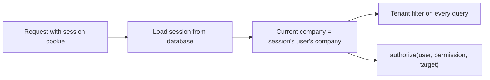

# Tenancy: keeping companies separate

**In short:** many companies share one database. Four independent protections make sure a user of one company can never see or change another company's data: an automatic filter on every query, database links that include the company, tests that try to cross between companies, and "not found" answers that give nothing away.

Decision: [0016](https://github.com/workforce-ops-app/.github/blob/main/docs/decisions/0016-tenant-isolation.md).

> **Status:** design. This page describes how the code will work once the backend is scaffolded; code references will be added then.

## Where the company comes from

- The current company is taken **only** from the server-side session.
- A `company_id` in a URL, query string, or request body is never trusted to decide which company's data to use.
- Background jobs set the company explicitly for each unit of work, and log what they did with actor `system`.

## The four layers

| Layer | What it does | What it catches |
|---|---|---|
| 1. Automatic filter | A SQLAlchemy hook adds `company_id = current company` to every query on a company-owned model. A query with no current company raises an error | A repository function that forgets to filter |
| 2. Company-aware links | Unique key `(company_id, id)` on company-owned tables; foreign keys include `company_id` | Code that tries to link a record to another company's record, even if layer 1 is bypassed |
| 3. Tests | `tests/security/` seeds two companies and requests company B's records as a company A user on every endpoint. A second test checks every model with `company_id` is covered by the filter | Regressions, new endpoints, and new tables added without protection |
| 4. "Not found" | Another company's record returns **404**, exactly like a record that does not exist | Attackers probing which IDs exist |

## Rules for contributors

- Never pass a company ID from the request into a query. Use the current company from the request context.
- Never disable the filter in feature code. Platform code that must read across companies lives in a separate, clearly named module, requires platform permissions, and writes to the platform audit chain.
- Every new company-owned model must follow the [data model conventions](data-model.md#conventions-for-every-table); the coverage test fails otherwise.
- Every new endpoint that takes an ID gets a cross-company test in `tests/security/`.
- Return 404 for records outside the user's company, and 403 only for records **inside** the company that the user's scope does not cover.

## Relation to authorization

Tenancy decides **which company's data exists** for a request. Authorization (`authorize()`, [0017](https://github.com/workforce-ops-app/.github/blob/main/docs/decisions/0017-scoped-role-assignments.md)) then decides what the user may do **within** that company, based on their role assignments and scopes. Both always apply.

## Known limits

- MySQL has no row-level security, so layer 1 lives in the application. Layers 2–4 exist so that a single application bug is not enough to leak data.
- Direct database access (for example with a stolen database password) bypasses layer 1. Database credentials are therefore limited per purpose (application vs migrations), and audit tables are append-only for the application user ([audit log](audit-log.md)).
