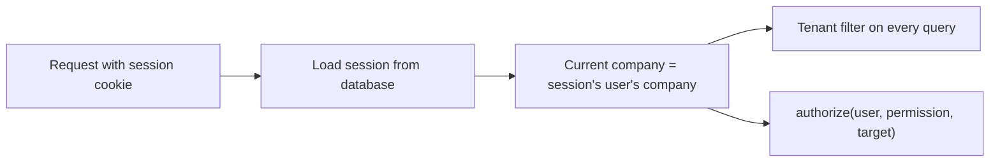

# Tenancy: keeping companies separate

**In short:** many companies share one database. Four independent protections make sure a user of one company can never see or change another company's data: an automatic filter on every query, database links that include the company, tests that try to cross between companies, and "not found" answers that give nothing away.

Decision: [0016](https://github.com/workforce-ops-app/.github/blob/main/docs/decisions/0016-tenant-isolation.md).

> **Status:** layers 1 and 2 are built, with their layer 3 tests: the filter in `app/tenancy/`, the company-aware keys on the first tables (`app/modules/org/models.py`, migration `0002`), and `tests/security/test_cross_company.py` and `test_org_company_links.py`. Layer 4 arrives with the first endpoints.

## Where the company comes from

```mermaid
flowchart LR
    R[Request with session cookie] --> S[Load session from database]
    S --> C[Current company = session's user's company]
    C --> F[Tenant filter on every query]
    C --> A["authorize(user, permission, target)"]
```

- The current company is taken **only** from the server-side session.
- A `company_id` in a URL, query string, or request body is never trusted to decide which company's data to use.
- Background jobs set the company explicitly for each unit of work, and log what they did with actor `system`.

## The four layers

| Layer | What it does | What it catches |
|---|---|---|
| 1. Automatic filter | A SQLAlchemy hook adds `company_id = current company` to every query on a company-owned model, including lookups by ID, counts, joins, and bulk updates and deletes. Saving checks the company too: a new row gets the session's company, and a row for another company, one moved to another company, or deleting another company's row, is refused. A last guard at the database connection refuses any company data that reaches the database without these checks. A query or save with no current company raises an error | A repository function that forgets to filter, or a request body with a forged `company_id` |
| 2. Company-aware links | Unique key `(company_id, id)` on company-owned tables; foreign keys include `company_id` | Code that tries to link a record to another company's record, even if layer 1 is bypassed |
| 3. Tests | `tests/security/` seeds two companies and requests company B's records as a company A user on every endpoint. A second test checks every model with `company_id` is covered by the filter | Regressions, new endpoints, and new tables added without protection |
| 4. "Not found" | Another company's record returns **404**, exactly like a record that does not exist | Attackers probing which IDs exist |

## How it works in code

| Part | Where | What it does |
|---|---|---|
| The current company | `app/tenancy/context.py` | `set_company(session, company_id)` stores the company on the database session (`session.info`); `get_company(session)` reads it. A session works for one company only; switching is refused |
| Company-owned models | `app/tenancy/filter.py` | `CompanyOwned` adds the required, indexed `company_id` column and turns the filter on for that model: `class Shift(IdAndTimestamps, CompanyOwned, Base)` |
| The companies table | `app/tenancy/filter.py` | `CompanyRecord` marks `Company`: each row is a company, so a session working for a company sees only its own row (`id = <company>`), may change only that row, and cannot create or delete companies. Sessions with no company (platform code, the seed script) manage companies |
| The filter | `app/tenancy/filter.py` | On every statement a session runs (`do_orm_execute`), adds the company condition with `with_loader_criteria` and refuses the forms it cannot make safe (below); before every save (`before_flush`), fills in or checks `company_id` on new, changed, and deleted rows |
| The last guard | `app/tenancy/filter.py` | On every statement any connection runs (`before_execute`), refuses a read or write of a company table that neither passed the query hook nor belongs to a checked save. That catches SQLAlchemy's older bulk methods and `session.connection().execute(...)`. Only migrations mark their connection as trusted (`trust_connection`) |
| Tests | `tests/security/test_cross_company.py`, `tests/unit/test_tenancy.py` | Company A tries to list, fetch by ID, count, join, update, delete, create for, and move rows into company B, including through bulk statements and the raw table; and every model with a `company_id` column must use `CompanyOwned`, except the audit log's tables, whose platform chain has no company; they are written only by `record()`, which takes the company from the session ([audit log](audit-log.md#recording-an-action)) |

**Why the company is stored on the session, not in a "current request" variable:** each request already gets its own database session, so the company travels with it and cannot leak into another request. FastAPI runs ordinary functions in worker threads, where a value set for one step is not reliably visible in the next.

**Refused, because the filter cannot make them safe** (`UnsafeQueryError`, or `WrongCompanyError` where a statement would change which company a row or company is):

| Form | Why it is refused | Use instead |
|---|---|---|
| The table instead of the model, e.g. `select(Shift.__table__)` | the company condition is only added through models | the model: `select(Shift)` |
| A query that names the model only in `select_from` (e.g. a count written as SQL text) | SQLAlchemy does not see the model there, so it would go unfiltered | name a model column: `select(func.count(Shift.id))` |
| A bulk insert, `session.execute(insert(Shift)...)` | it skips the save check that fills in and checks `company_id` | `session.add()` or `session.add_all()` |
| A bulk update or delete given a list of rows by ID | it runs without the company condition | load the rows and change them, or update with a `where` clause |
| A bulk update that sets `company_id` | the condition only limits which rows change, not what they change to | never change `company_id` |
| In a session working for a company: a bulk delete of companies, `delete(Company)`, or a bulk update that sets a company's `id` | both skip the save check that keeps companies from being deleted, and a company's `id` is the value the filter uses to tell companies apart | companies are deleted by platform code only; a company's `id` never changes |
| The older bulk methods (`bulk_insert_mappings`, `bulk_update_mappings`, `bulk_save_objects`) and statements on `session.connection()` | they write to the database without the query hook or the save check (refused by the last guard) | `session.add()`, loaded rows, or a `where` update through the session |

**Raw SQL is not filtered.** `session.execute(text("SELECT ..."))` bypasses the ORM and therefore the filter. Repositories build every query with SQLAlchemy ([layers and modules](layers-and-modules.md#the-database-layer)), never as SQL text.

## Rules for contributors

- Never pass a company ID from the request into a query. Use the current company from the request context.
- Never disable the filter in feature code. Platform code that must read across companies lives in a separate, clearly named module, requires platform permissions, and writes to the platform audit chain.
- Every new company-owned model inherits `CompanyOwned` and follows the [data model conventions](data-model.md#conventions-for-every-table); the coverage test fails for any model with a `company_id` column that does not.
- Every new endpoint that takes an ID gets a cross-company test in `tests/security/`.
- Return 404 for records outside the user's company, and 403 only for records **inside** the company that the user's scope does not cover.

## Relation to authorization

Tenancy decides **which company's data exists** for a request. Authorization (`authorize()`, [0017](https://github.com/workforce-ops-app/.github/blob/main/docs/decisions/0017-scoped-role-assignments.md)) then decides what the user may do **within** that company, based on their role assignments and scopes, and, for actions on a person, their place in the reporting chain ([0024](https://github.com/workforce-ops-app/.github/blob/main/docs/decisions/0024-authorization-model.md)). Both always apply.

## Known limits

- MySQL has no row-level security, so layer 1 lives in the application. Layers 2 to 4 exist so that a single application bug is not enough to leak data.
- Direct database access (for example with a stolen database password) bypasses layer 1. Database credentials are therefore limited per purpose (application vs migrations), and audit tables are append-only for the application user ([audit log](audit-log.md)).
