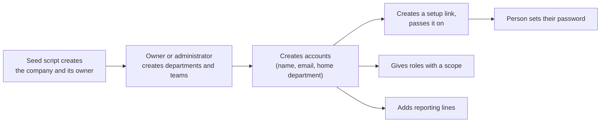
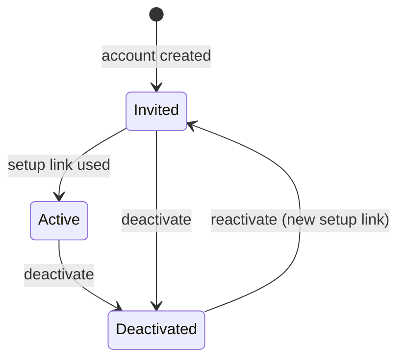

# Company structure, people, and access

- **Status:** tables built (`app/modules/org/models.py`, migration `0002`); demo companies, structure, people, and their roles seeded by `scripts/seed_demo.py`; this module's permissions declared (`app/modules/org/permissions.py`); endpoints planned (core tier)
- **Related:** workforce-ops-app/workforce-ops-backend#8; frontend page: administration screens (workforce-ops-app/workforce-ops-frontend#3); design: [data model](../architecture/data-model.md), [authorization](../architecture/authorization.md), [authentication](../architecture/authentication.md)

## In short
Administrators set up their company in the application: its departments and teams, the people who work there, what role each person has and where it applies, and who reports to whom. People are never deleted, only deactivated, so the history stays complete. For testing and the demos, a seed script creates two made-up companies with everything already filled in.

## Who can use it

| Role | Can | Permission | Scope |
|---|---|---|---|
| Owner, Administrator | create, rename, and archive departments and teams; move people between them | `org.manage` | company |
| Owner, Administrator | create accounts, create setup and reset links, change a person's details, deactivate and reactivate, unlock, sign out | `user.manage` | people they are above |
| Owner, Administrator | create roles and change them when every holder is below them | `role.manage` | company, with [delegation limits](../architecture/authorization.md#delegation-limits) |
| Owner, Administrator | give and remove roles; a role at their own level needs approval from above | `role.assign` | people they are above |
| Owner, Administrator | add and end reporting lines | `reporting_line.manage` | pairs of people they are above |
| Owner | propose adding or removing an owner | `company.transfer_ownership` | company |
| Manager | see the people in their scope and their roles | `user.view`, `role.view` | their assignment's scope |
| Everyone | see their own name, department, teams, roles, and managers | none | own account |
| Everyone | ask to change their own display name (core) or email (next tier); it takes effect once approved from above | `account.change_self` | own account |

These are the starting roles' defaults ([authorization](../architecture/authorization.md#starting-roles)); companies can change what their roles grant.

## How it works

1. The company and its first owner exist already: in the core tier, only the seed script creates companies.
2. An administrator creates departments (for example Kitchen, Front of House) and teams inside them (Weekend Crew).
3. They create an account for each person: name, email, and **home department**. The account has no password yet.
4. They create a **setup link** and give it to the person, who opens it and chooses a password ([authentication](../architecture/authentication.md#setup-and-reset-links)).
5. They give the person roles with a scope. Everyone normally gets the Employee role for their home department; a manager gets the Manager role for the department or team they run.
6. They add **reporting lines**: who reports to whom. These decide who reviews whose requests and who can change whose access.

---
## Details

### States and rules

**Departments and teams**
- Names are unique within the company (departments) or within the department (teams).
- Archiving instead of deleting ([0020](https://github.com/workforce-ops-app/.github/blob/main/docs/decisions/0020-status-over-deletion.md)). A department cannot be archived while it is someone's home department or has upcoming shifts (409); move the people and shifts first. Archiving a team ends its role assignments' effect (archived scopes cover nothing) and keeps its member list for history.

**People**

- **Invited:** no password yet; cannot sign in.
- **Deactivated:** cannot sign in; all sessions end and unused links are cancelled ([authentication](../architecture/authentication.md#sessions)). Upcoming shifts stay assigned and are listed for the administrator to reassign. Their records, roles, and reporting lines stay for history.
- **Reactivating** puts the person back to *Invited*: they set a new password with a fresh setup link.
- Every person has exactly one **home department** and may be on several **teams**. Changing the home department changes which department-scoped roles cover them.
- **Email addresses** are unique across the platform and stored in lowercase. When an address is taken, the answer is "this email can't be used" without saying where ([0016](https://github.com/workforce-ops-app/.github/blob/main/docs/decisions/0016-tenant-isolation.md)).
- Nobody deactivates, unlocks, or signs out themselves through these actions, and the last owner cannot be deactivated.

**Changing your own name or email** ([0032](https://github.com/workforce-ops-app/.github/blob/main/docs/decisions/0032-delegation-limits.md))
- A person asks for the change; nothing changes until it is approved.
- **Who approves:** the nearest person above them who holds `user.manage` (usually an administrator), walking up the chain and ending at the Owner.
- **Owners:** with several owners, another owner approves. A sole owner's request goes to platform staff; until platform staff screens exist, the platform operators decide with a command-line tool, recorded in the platform audit chain.
- **Email (next tier):** the password must be re-entered when asking; the address must not be taken (checked when asked and again when approved, with the generic answer if taken); when the change takes effect, the person's other sessions end. A confirmation link to the new address can be added once email delivery exists.
- Requests not decided within 7 days expire.
- Administrators with `user.manage` who are above the person can still change the name or email directly.

**Roles, assignments, reporting lines, and owners** follow the [authorization](../architecture/authorization.md) page: rules AZ1 to AZ15, the delegation limits, and the approval requests for same-level grants and owner changes. Actions marked *sensitive* there need the password re-entered.

### Backend

**Endpoints** (all under `/api`, following [0026](https://github.com/workforce-ops-app/.github/blob/main/docs/decisions/0026-api-conventions.md)):

| Method and path | Permission | Does |
|---|---|---|
| `GET /departments`, `GET /teams` | signed in | list (everyone can see the company's structure) |
| `POST /departments`, `PATCH /departments/{id}`, `POST /departments/{id}/archive` | `org.manage` | create, rename or set the time zone, archive |
| `POST /teams`, `PATCH /teams/{id}`, `POST /teams/{id}/archive` | `org.manage` | create, rename, archive |
| `POST /teams/{id}/members`, `DELETE /teams/{id}/members/{user_id}` | `org.manage` | add or remove a team member |
| `GET /users`, `GET /users/{id}` | `user.view` (scope filter) | list and view people |
| `POST /users` | `user.manage` | create an account (name, email, home department) |
| `PATCH /users/{id}` | `user.manage`, above the person | change name, email, or home department |
| `POST /users/{id}/deactivate`, `POST /users/{id}/reactivate` | `user.manage`, above the person | change account state |
| `GET /roles` | `role.view` | list roles and what they grant |
| `POST /roles`, `PATCH /roles/{id}`, `POST /roles/{id}/archive` | `role.manage` (delegation limits) | create, change, archive |
| `GET /role-assignments?user_id=` | `role.view` | a person's roles and scopes |
| `POST /role-assignments` | `role.assign`, above the person | give a role; answers **201** when it takes effect, **202** with an approval request when it needs approval from above |
| `DELETE /role-assignments/{id}` | `role.assign`, above the person | remove a role |
| `GET /reporting-lines?user_id=` | `user.view` | a person's managers and reports |
| `POST /reporting-lines`, `POST /reporting-lines/{id}/end` | `reporting_line.manage`, above both people | add or end a line |
| `POST /owners`, `POST /owners/{user_id}/remove` | Owner | propose an owner change (an approval request) |
| `POST /me/account-changes` `{display_name}` or `{email}` | `account.change_self` (email: next tier, password re-entry) | ask to change your own name or email; answers 202 with an approval request |
| `GET /approval-requests` | signed in | requests you made and requests waiting for you |
| `POST /approval-requests/{id}/approve`, `.../deny`, `.../cancel` | the eligible approver, or the requester for cancel | decide or withdraw |

Setup links, reset links, unlocking, and signing someone out are on the [authentication](../architecture/authentication.md#endpoints) page.

**Tables:** `companies`, `departments`, `teams`, `users`, `team_members`, `roles`, `role_permissions`, `role_assignments`, `reporting_lines`, `approval_requests`, `approval_decisions` ([data model](../architecture/data-model.md)).

**Scope resolver:** a person belongs to their home department, their teams, and themselves.

### Demo data

The seed script (`python -m scripts.seed_demo`) creates the same data on every run, for local use, CI, and the demos ([0031](https://github.com/workforce-ops-app/.github/blob/main/docs/decisions/0031-demo-environment-and-data.md)):

- **Two companies**, for example *Northwind Cafe* (America/Chicago) and *Summit Outfitters* (America/Denver), built alike on purpose: same department names and similar people, so a leak between companies is obvious in tests and demos.
- In each company: two or three departments, a team or two in each, and people in every starting role. Each company gets the four starting roles; everyone holds Employee for their home department, owners and administrators their role for the whole company, and managers Manager for their home department (built, Z1).
- **Reporting lines** that exercise the rules: a two-level chain, someone with two managers, an administrator over other administrators, and someone with no manager.
- Two weeks of shifts, including open shifts, and a few time-off requests in each state.
- Emails use the reserved `example.com` and `example.org` domains. Demo passwords come from an environment variable, never from the repository.
- The script refuses to run against a production database.

### Audit and security

**Audit events:** `department.created`, `department.updated`, `department.archived`, `team.created`, `team.updated`, `team.archived`, `team_member.added`, `team_member.removed`, `user.created`, `user.updated` (details: which fields), `user.deactivated`, `user.reactivated`, `user.change_requested` (details: which field); approved changes are recorded as `user.updated` with the approver; plus the role, reporting-line, ownership, and approval events on the [authorization](../architecture/authorization.md#audit-events) page.

**Threats** ([threat model](../security/threat-model.md)): I1 and T3 (other companies' people), I2 (people outside scope), I3 (email already taken), E1 to E6 and E9 (access changes).

**Security tests:**
- Every endpoint above, requested as a user of the other demo company, answers 404.
- A manager cannot list or view people outside their scope (403).
- Every escalation rule AZ1 to AZ15 has a test.
- Deactivation ends the person's sessions and cancels their links.
- Creating an account with an email used by the other company gives the generic answer.
- A person's own name change does not take effect before approval; the approver must hold `user.manage` and be above them; nobody approves their own change.
- (Next tier) An email change without a recent password re-entry is refused; an address taken between request and approval is refused at approval.

### Known limitations
- No screen for creating companies or platform staff accounts yet; the seed script does it.
- No bulk import of people.
- Changing your own email arrives with the next tier; until then an administrator changes it.
- A sole owner's name change waits for the platform operators' command-line tool until platform staff screens exist.
