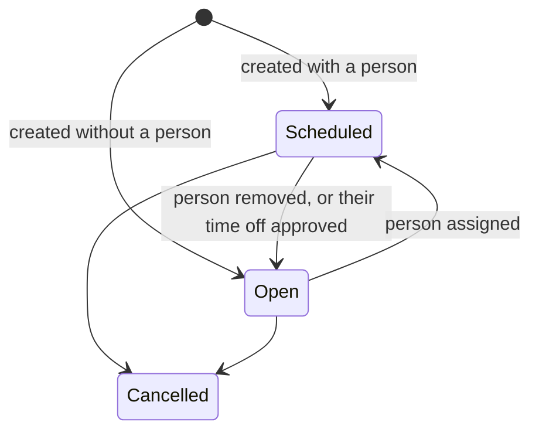

# Schedules and shifts

- **Status:** planned (core tier)
- **Related:** workforce-ops-app/workforce-ops-backend#9; frontend page: schedule screens (workforce-ops-app/workforce-ops-frontend#3); design: [data model](../architecture/data-model.md#shifts), [authorization](../architecture/authorization.md)

## In short
Managers plan who works when. Each shift is a block of time in one department, worked by one person, or by nobody yet (an **open shift**). Employees see their own shifts and, by default, their department's schedule. Times are entered and shown in the workplace's own time zone, so daylight-saving changes never move a shift. Cancelled shifts are kept, not deleted.

## Who can use it

| Role | Can | Permission | Scope |
|---|---|---|---|
| Everyone | see their own shifts | `schedule.view_self` | own shifts |
| Employee (default) | see their home department's schedule, including open shifts | `schedule.view` | home department |
| Manager | see, create, change, assign, and cancel shifts | `schedule.view`, `schedule.edit` | the department or team they manage |
| Owner, Administrator | the same, company-wide | `schedule.view`, `schedule.edit` | company |

An administrator can remove `schedule.view` from the Employee role; employees then see only their own shifts.

## How it works
1. A manager opens a department's week and adds shifts: start and end time, the person working it (or nobody, for an open shift), and optionally details ("Register 2"), notes, and an event ("Inventory night").
2. They can change a shift, give it to someone else, make it open, or cancel it.
3. Changes that affect **10 or more shifts at once** show a confirmation with the number of shifts before anything is saved ([0025](https://github.com/workforce-ops-app/.github/blob/main/docs/decisions/0025-sensitive-actions-and-security-settings.md)).
4. Employees see their upcoming shifts, and their department's week, in the workplace's time zone.
5. When time off is approved, the person's shifts on those days become **open** and are flagged until someone takes them ([time off](time-off.md)).

Shifts are visible as soon as they are saved. Planning a week as a draft and publishing it later comes with the next tier.

---
## Details

### States and rules

- **Status and person match:** a shift is `open` exactly when it has no person; the database enforces this with a `CHECK` ([data model](../architecture/data-model.md#shifts)).
- **Times:** entered in the **workplace zone** (the department's time zone, or the company's), stored in UTC, and the zone is copied onto the shift so later changes never move it ([0021](https://github.com/workforce-ops-app/.github/blob/main/docs/decisions/0021-time-handling.md)). The end is after the start; a shift is at most 16 hours long.
- **Who can be assigned:** an active person whose home department is the shift's department, or who is on a team in it. Invited or deactivated people cannot be assigned.
- **No double booking:** a person cannot have two shifts that overlap (409).
- **Time off:** a person cannot be assigned during their approved time off (409).
- **Past shifts:** once a shift has ended it cannot be changed or cancelled (409); its notes are history.
- **Cancelling** keeps the shift with status `cancelled` ([0020](https://github.com/workforce-ops-app/.github/blob/main/docs/decisions/0020-status-over-deletion.md)); it disappears from normal views.
- **Several shifts at once:** a manager can create the same shift on several chosen days, or cancel or reassign several selected shifts. When the change affects 10 or more shifts, the request must repeat the count it expects (`confirm_count`); a wrong or missing count is refused (409) and nothing is saved.
- **Text fields** (details, notes, event) are shown as plain text only ([threat model](../security/threat-model.md) T5).

### Backend

**Endpoints** (under `/api`, [0026](https://github.com/workforce-ops-app/.github/blob/main/docs/decisions/0026-api-conventions.md)):

| Method and path | Permission | Does |
|---|---|---|
| `GET /shifts?from=&to=&department_id=&employee_id=&status=` | `schedule.view` (scope filter), or `schedule.view_self` with `employee_id` = self | list shifts in a date range (at most 31 days per request, paged) |
| `GET /shifts/{id}` | `schedule.view` or `schedule.view_self` | one shift |
| `POST /shifts` | `schedule.edit` for the department | create one shift |
| `PATCH /shifts/{id}` | `schedule.edit` | change times, details, notes, event |
| `POST /shifts/{id}/assign` `{employee_id}` | `schedule.edit` | give the shift to a person, or `null` to make it open |
| `POST /shifts/{id}/cancel` | `schedule.edit` | cancel |
| `POST /shifts/batch` | `schedule.edit` for every shift involved | create on several days, or cancel or reassign several; needs `confirm_count` at 10 or more |

Times are sent and returned as ISO 8601 moments with an offset, plus the shift's `timezone`, so the interface shows them in the workplace's zone.

**Tables:** `shifts` ([data model](../architecture/data-model.md#shifts)).

**Scope resolver:** a shift belongs to its department and, when assigned, to its person (and through them their teams). A manager of the Weekend Crew team therefore covers the shifts of the team's members.

### Audit and security

**Audit events:** `shift.created`, `shift.updated` (details: fields changed), `shift.assigned`, `shift.opened`, `shift.cancelled`, `shift.batch_changed` (details: action and count; one entry per batch plus one per shift).

**Threats** ([threat model](../security/threat-model.md)): I1 and T3 (other companies' shifts), I2 (shifts outside scope), T2 (setting the company or status directly), T5 (text fields), D2 (huge date ranges), D3 (mass cancelling).

**Security tests:**
- Every shift endpoint, as a user of the other demo company, answers 404.
- A manager cannot view or change shifts outside their department or team (403); an employee without `schedule.view` sees only their own.
- An employee cannot create or change shifts, even by calling the API directly (E8).
- Assigning someone from another company, a deactivated person, or someone on approved time off is refused.
- A batch of 10 or more without the right `confirm_count` changes nothing.

### Known limitations
- No draft-and-publish yet (next tier): shifts are visible once saved.
- No repeating shift patterns beyond "the same shift on these days".
- Rest time between shifts and weekly hour limits are checked with coverage (next tier), not here.
- Times are shown in the workplace's zone, not each viewer's own zone.
