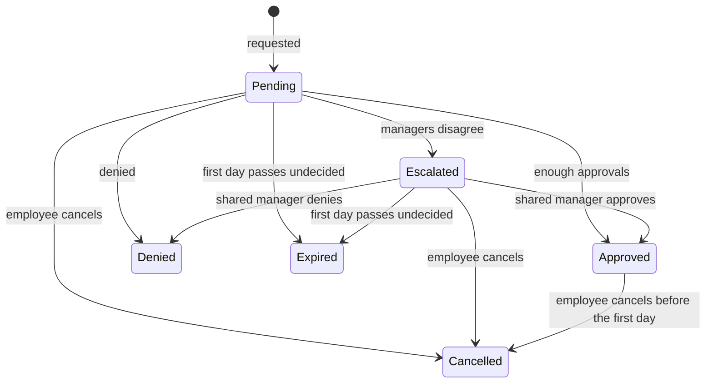

# Time-off requests

- **Status:** planned (core tier)
- **Related:** workforce-ops-app/workforce-ops-backend#10; frontend page: time-off screens (workforce-ops-app/workforce-ops-frontend#3); design: [authorization](../architecture/authorization.md), [data model](../architecture/data-model.md#approval_requests), [schedules](schedules.md)

## In short
Employees ask for days off. The request goes to the people they report to directly, who approve or deny it. If those managers disagree, the request moves up to the nearest person above all of them, whose decision settles it. Nobody reviews their own request. When a request is approved, the employee's shifts on those days become open so a manager can give them to someone else.

## Who can use it

| Role | Can | Permission | Scope |
|---|---|---|---|
| Everyone | ask for time off; cancel their own request | `time_off.request`, `time_off.cancel_self` | own requests |
| Manager | see requests of people in scope; approve or deny the requests of people they are above | `time_off.view`, `time_off.review` | their scope; reviews also need a position above the employee |
| Owner, Administrator | the same, company-wide | `time_off.view`, `time_off.review` | company; reviews still need a position above (the Owner is above everyone) |

## How it works

```mermaid
sequenceDiagram
    participant E as Employee
    participant A as API
    participant M as Direct managers
    participant N as Nearest shared manager
    E->>A: request days off
    A->>A: find reviewers in the reporting chain
    A-->>M: request waits on their review page
    M->>A: approve / deny
    alt enough approvals, no denial
        A->>A: approved; affected shifts become open
    else a denial, no approval
        A->>A: denied
    else managers disagree
        A-->>N: request moves up
        N->>A: approve / deny (settles it)
    end
    A-->>E: status shown on their page
```

1. The employee picks the first and last day and may add a short reason. The request shows which of their shifts fall on those days.
2. It goes to their **direct managers** who hold `time_off.review`. If none of them can review it (or the employee has no manager), it moves up the chain until someone can, ending at the Owner ([0029](https://github.com/workforce-ops-app/.github/blob/main/docs/decisions/0029-request-approval-routing.md)).
3. Reviewers see the request, its affected shifts, and the other reviewers' decisions. Anyone higher in the chain may also step in.
4. When it is approved, the employee's shifts on those days become **open**. The manager can give them to someone else before or after the decision ([schedules](schedules.md)).
5. The employee can cancel their request until its first day.

In the core tier, requests and their status are shown on the pages; notifications come with the next tier.

---
## Details

### States and rules



- **Whole days only**, from a first to a last day (at most 30 days per request), stored as `DATE` in the employee's workplace zone ([0021](https://github.com/workforce-ops-app/.github/blob/main/docs/decisions/0021-time-handling.md)). The first day is today or later.
- **No overlap:** a new request may not overlap the employee's own pending, escalated, or approved requests (409).
- **Required approvals:** a company setting, `time_off.required_approvals`, default **1**, counted among the direct managers ([company settings](../architecture/data-model.md#company_settings)). If fewer direct managers can review than required, administrators are told the setting is misconfigured and all available direct managers are required instead.
- **Outcome among direct managers:**
  - enough approvals and no denial: **approved**;
  - denials and no approval: **denied**;
  - both approvals and a denial: **escalated** to the **nearest shared manager**, the lowest person above all of the managers who decided. That person's decision settles it; with several equally near, the first decision settles it; with none, the Owner decides.
- **No self-review:** nobody reviews their own request; a manager's request goes to their own managers.
- **Reviewers are checked at the moment they decide** (still above the employee, still holding `time_off.review`).
- **On approval:** every shift of the employee that overlaps the approved days becomes **open** (`employee_id` cleared, status `open`), with an audit entry linking it to the request.
- **Cancelling an approved request** does not give the shifts back automatically; the manager reassigns them.
- **Expiry:** a request still undecided when its first day arrives expires. Time-off requests do not use the 7-day expiry that role grants and owner changes use ([0032](https://github.com/workforce-ops-app/.github/blob/main/docs/decisions/0032-delegation-limits.md)), since people often ask weeks ahead.
- **Next tier:** advance-notice and deadline policies, reminders, notifications. Attachments (for example a doctor's note) are stretch.

### Backend

**Endpoints** (under `/api`, [0026](https://github.com/workforce-ops-app/.github/blob/main/docs/decisions/0026-api-conventions.md)):

| Method and path | Permission | Does |
|---|---|---|
| `GET /time-off-requests?mine=true` | `time_off.request` | your own requests |
| `GET /time-off-requests?status=&employee_id=&from=&to=` | `time_off.view` (scope filter) | requests of people in scope |
| `GET /time-off-requests/waiting` | signed in | requests waiting for your review |
| `GET /time-off-requests/{id}` | owner of the request, or `time_off.view` | one request, with its affected shifts and decisions so far |
| `POST /time-off-requests` `{first_day, last_day, reason}` | `time_off.request` | ask for time off |
| `POST /time-off-requests/{id}/cancel` | `time_off.cancel_self` | cancel your own request |
| `POST /time-off-requests/{id}/approve`, `POST /time-off-requests/{id}/deny` `{comment}` | `time_off.review`, above the employee | decide |

**Table: `time_off_requests`** (feature table; the shared approval tables are on the [data model](../architecture/data-model.md#approval_requests) page)

| Column | Type | Rules |
|---|---|---|
| `id` | `BINARY(16)` | primary key |
| `company_id` | `BINARY(16)` | required |
| `employee_id` | `BINARY(16)` | required; company-aware foreign key to `users` |
| `first_day`, `last_day` | `DATE` | required; `CHECK (last_day >= first_day)`; in the employee's workplace zone |
| `reason` | `VARCHAR(500)` | optional; shown as plain text |
| `status` | `VARCHAR(12)` | `pending`, `escalated`, `approved`, `denied`, `cancelled`, or `expired` |
| `approval_request_id` | `BINARY(16)` | required; company-aware foreign key to `approval_requests` (kind `time_off`) |
| `decided_at` | `DATETIME(6)` | null until approved, denied, cancelled, or expired |

| From | To | How many | Enforced by | Meaning |
|---|---|---|---|---|
| users | time_off_requests | one to many | company-aware foreign key | A person can ask for time off many times |
| time_off_requests | approval_requests | one to one | company-aware foreign key, unique | Each request has one approval record holding its decisions |

**Approval record:** kind `time_off`; `required_approvals` from the company setting; decisions in `approval_decisions`. When the request escalates, the payload records the nearest shared manager(s), and their decision settles it (this kind's own rule instead of "any denial denies").

**Scope resolver:** a request belongs to its employee, and through them to their home department and teams.

**Background job:** once a day, requests still pending or escalated whose first day has arrived are marked expired (actor `system`).

### Audit and security

**Audit events:** `time_off.requested`, `time_off.approved`, `time_off.denied`, `time_off.escalated` (details: who it went to), `time_off.cancelled`, `time_off.expired` (actor `system`), and `shift.opened` for each shift opened by an approval (details: the request).

**Threats** ([threat model](../security/threat-model.md)): E5 (approving your own request), E3 (reviewing someone you are not above), I1 and I2 (seeing others' requests), T2 (setting the status directly), T5 (reason text).

**Security tests:**
- Nobody can approve or deny their own request, even with `time_off.review` (AZ7).
- A manager who is not above the employee cannot review, even with the permission and scope.
- Disagreement escalates to the nearest shared manager; with no shared manager, to the Owner.
- An employee cannot see other people's requests without `time_off.view` in scope; other companies' requests answer 404.
- Approval opens exactly the overlapping shifts, and nothing else.

### Known limitations
- Whole days only; no part-day requests.
- No notifications in the core tier; reviewers check their page.
- Cancelling an approved request leaves the opened shifts open.
