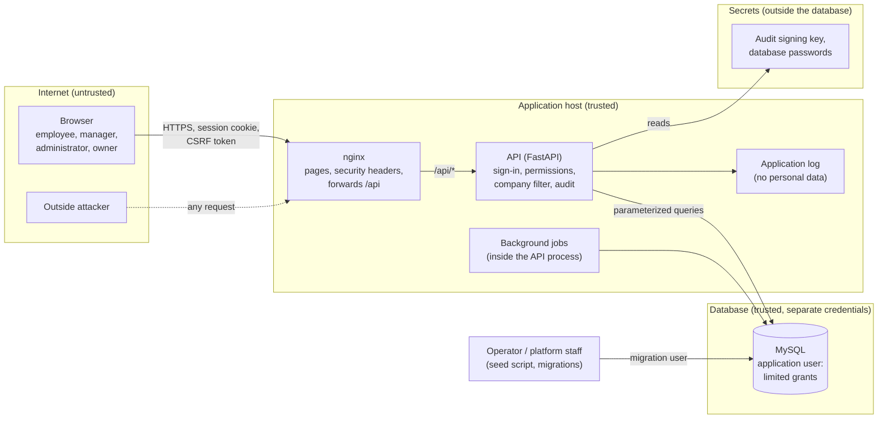

# Threat model

**In short:** a map of how data moves through the application, who might attack it, and what could go wrong at each step, with the protection that answers each threat and the test that proves it. It was written before any code, so the code is built against it, and the security audits check the application against it. It covers the core tier; each later feature adds its own rows.

> **Status:** design, core tier. Method: STRIDE on a data-flow diagram with four attacker profiles ([decision 0030](https://github.com/workforce-ops-app/.github/blob/main/docs/decisions/0030-security-study-method.md)).

## What we protect

| Asset | Why it matters |
|---|---|
| Company data: people, schedules, time-off requests | Personal and business information; each company must only ever see its own |
| Credentials: password hashes, session tokens, one-time setup and reset links | Whoever holds them can act as the user |
| Access rules: roles, role assignments, reporting lines | Access is handed down from the owner: only the owner holds every permission, and each person can pass on at most what they hold, only to people below them. Whoever changes these rules outside that path could give themselves or others more power than the owner intended |
| The audit log and its signing key | The trustworthy record of who did what |
| Availability | People need to see their shifts and request time off when they need to |
| Backups (next tier) | The way back after data is destroyed |

## How data moves

**Trust boundaries:**

| # | Boundary | What crosses it | Rule |
|---|---|---|---|
| TB1 | Internet → nginx | every request | nothing from the browser is trusted: not the body, not hidden fields, not IDs |
| TB2 | nginx → API | forwarded `/api` requests | the API checks sign-in, CSRF, and permissions on every request; nginx adds headers only |
| TB3 | API → database | queries | only through SQLAlchemy with bound parameters; the application's database user cannot drop, truncate, or alter tables, and can only add to the audit log |
| TB4 | API → secrets | the audit signing key, database passwords | kept in the environment, never in the database or the repositories |
| TB5 | Company → company | nothing | every company's data is in the same database but must never cross ([tenancy](../architecture/tenancy.md)) |
| TB6 | Person → person inside a company | actions on someone else's account, roles, or requests | allowed only with the right permission and a position above that person in the reporting chain |

## Who might attack

| Profile | Starting point | What they want |
|---|---|---|
| **P1 Outside attacker** | no account; can send any request from the internet | take over accounts, read data, disrupt the service |
| **P2 Malicious employee** | a valid account with the Employee role | see coworkers' or other companies' data, give themselves more access, approve their own requests, hide what they did |
| **P3 Compromised manager or administrator** | a privileged account, stolen or misused | reach people outside their part of the company, raise their own access further, change many records at once, cover their tracks |
| **P4 Rogue platform staff** | access to the server or the database | read companies' data, change records directly, rewrite the audit log, destroy data or backups |

The profiles are also how audit findings are grouped for research question RQ2 ([report plan](https://github.com/workforce-ops-app/.github/blob/main/docs/project/report-plan.md)).

## Threats and protections

Each row names the threat, who could carry it out, the protection (with the decision that sets it), and how it is tested. IDs are stable: findings, tests, and pull requests refer to them.

### Spoofing: pretending to be someone else

| ID | Threat | Profiles | Protection | Tested by |
|---|---|---|---|---|
| S1 | Guessing passwords, or trying passwords leaked from other sites | P1 | at least 15 characters, common-password blocklist, Argon2id hashing, escalating lockouts (never longer than 1 hour), 20 sign-in attempts per minute per address ([0027](https://github.com/workforce-ops-app/.github/blob/main/docs/decisions/0027-authentication-and-sessions.md)) | lockout and rate-limit tests; Burp Suite |
| S2 | Stealing a session cookie (via XSS, an unencrypted connection, or a shared computer) | P1, P2 | `__Host-session` cookie with `Secure; HttpOnly; SameSite=Strict`; HTTPS only; strict Content Security Policy; 1 hour idle and 30 day maximum session | cookie attribute tests; idle and maximum expiry tests |
| S3 | Session fixation: planting a known session ID before the victim signs in | P1 | a new session ID at sign-in and on password change | test that the session ID changes at sign-in |
| S4 | Forged requests (CSRF): another site makes the victim's browser send a request | P1 | CSRF token in the `X-CSRF-Token` header, `SameSite=Strict`, Origin check | requests with a missing or wrong token or Origin are rejected |
| S5 | Stealing or guessing a setup or reset link | P1, P2 | long random token stored only as a hash, single use, 48 hours by default, token kept in the link's `#` part so it is never sent to servers or logs; using it signs out other sessions | tests for reuse, expiry, and wrong tokens |

### Tampering: changing data without permission

| ID | Threat | Profiles | Protection | Tested by |
|---|---|---|---|---|
| T1 | SQL injection | P1, P2 | database access only through SQLAlchemy with bound parameters, no hand-built SQL strings ([0022](https://github.com/workforce-ops-app/.github/blob/main/docs/decisions/0022-sqlalchemy-and-alembic.md)) | sqlmap and ZAP; security lint rules in CI; detection study |
| T2 | Changing fields the user must not set, such as `company_id`, status, or the author | P2 | request schemas list the allowed fields; the company always comes from the session ([0016](https://github.com/workforce-ops-app/.github/blob/main/docs/decisions/0016-tenant-isolation.md)) | tests that send extra fields |
| T3 | Changing another company's records by guessing or reusing IDs | P1, P2, P3 | automatic company filter, company-aware foreign keys, 404 for other companies' records (0016) | cross-company suite on every endpoint |
| T4 | Editing, removing, or inserting audit entries directly in the database | P3, P4 | HMAC-signed chain with the key outside the database; the application's database user may only add entries; nightly verification; latest signatures copied to the application log ([0018](https://github.com/workforce-ops-app/.github/blob/main/docs/decisions/0018-audit-log-chains.md)) | verification test with a tampered, a removed, and an inserted entry |
| T5 | Stored XSS: script hidden in names, shift notes, or request comments | P2, P3 | text is always shown with `textContent`, never `innerHTML` (enforced by lint); strict Content Security Policy with no inline scripts ([0005](https://github.com/workforce-ops-app/.github/blob/main/docs/decisions/0005-frontend-multi-page-vanilla-js.md)) | XSS payloads in every text field; ZAP |

### Repudiation: denying having done something

| ID | Threat | Profiles | Protection | Tested by |
|---|---|---|---|---|
| R1 | Denying an approval, a role change, or a schedule change | P2, P3 | every such action writes an audit entry in the same database transaction, naming the actor (0018); sensitive actions need the password re-entered ([0025](https://github.com/workforce-ops-app/.github/blob/main/docs/decisions/0025-sensitive-actions-and-security-settings.md)) | tests assert the audit entry for each action |
| R2 | Covering one's tracks by removing audit entries | P3, P4 | the application cannot remove entries; any removal breaks the chain (T4) | as T4 |

### Information disclosure: seeing what you should not

| ID | Threat | Profiles | Protection | Tested by |
|---|---|---|---|---|
| I1 | Reading another company's records | P1, P2, P3 | the four tenancy layers (0016) | cross-company suite |
| I2 | Reading records in your own company outside your scope | P2, P3 | `authorize()` on every record and a scope filter on every list ([authorization](../architecture/authorization.md)) | scope tests: 403 inside the company |
| I3 | Finding out which records, people, or email addresses exist | P1, P2, P3 | IDs are not guessable (UUIDv7); other companies' records answer 404; sign-in gives the same error for an unknown email and a wrong password | tests compare responses for existing and missing records and accounts |
| I4 | Error messages that reveal internals (stack traces, SQL) | P1 | one error format that never includes internal details ([0026](https://github.com/workforce-ops-app/.github/blob/main/docs/decisions/0026-api-conventions.md)) | tests with malformed input; ZAP |
| I5 | Leaking password hashes, tokens, or secrets | P1, P4 | Argon2id; session and link tokens stored only as hashes; secrets never committed (secret scanning in CI and git hooks); logs contain no personal details ([0031](https://github.com/workforce-ops-app/.github/blob/main/docs/decisions/0031-demo-environment-and-data.md)) | secret scan; log review in audits |

### Denial of service: making the application unusable

| ID | Threat | Profiles | Protection | Tested by |
|---|---|---|---|---|
| D1 | Flooding the sign-in form, or locking real users out on purpose | P1 | rate limits per address and per session; lockouts escalate but never exceed 1 hour, so they cannot lock someone out for good (0025, 0027) | rate-limit and lockout tests |
| D2 | Expensive requests: huge lists or bodies, slow queries | P1, P2 | lists are paged (at most 200 items); request size limits; query timeouts (0026) | tests with oversized requests |
| D3 | Destroying data from inside | P3, P4 | records are deactivated or archived, never deleted ([0020](https://github.com/workforce-ops-app/.github/blob/main/docs/decisions/0020-status-over-deletion.md)); the application's database user cannot drop or truncate; confirmation for changes to 10 or more shifts (0025); backups in the next tier ([0028](https://github.com/workforce-ops-app/.github/blob/main/docs/decisions/0028-backup-and-recovery.md)) | database grant test; restore drills (next tier) |

### Elevation of privilege: gaining more power than you were given

| ID | Threat | Profiles | Protection | Tested by |
|---|---|---|---|---|
| E1 | Giving yourself more access: editing your own roles or reporting lines | P2, P3 | nobody changes their own role assignments or reporting lines ([0024](https://github.com/workforce-ops-app/.github/blob/main/docs/decisions/0024-authorization-model.md)) | escalation tests |
| E2 | Granting a permission you do not hold, or copying your own level onto others without anyone above knowing | P3 | nobody grants a permission they do not hold (0024); giving a role at your own level needs approval from someone above you ([0032](https://github.com/workforce-ops-app/.github/blob/main/docs/decisions/0032-delegation-limits.md)) | escalation tests; approval tests |
| E3 | Acting on a peer or a superior, for example one administrator resetting another's password | P3 | acting on a person needs the permission **and** a position above them in the reporting chain (0024) | tests for peers, superiors, and people in other branches of the chain |
| E4 | Rearranging reporting lines to get above someone | P3 | adding or ending a line needs a position above both people, `reporting_line.manage`, and the password re-entered; loops are rejected; every change is audited (0024, 0025) | tests for loops, self-changes, and missing positions |
| E5 | Approving your own request | P2, P3 | nobody reviews their own request ([0029](https://github.com/workforce-ops-app/.github/blob/main/docs/decisions/0029-request-approval-routing.md)) | self-approval tests |
| E6 | Taking over a company: removing the last owner, adding yourself or an ally as owner, or one co-owner removing another | P3 | only owners add or remove owners, with the password re-entered; adding needs every current owner, removing needs every other owner; the last owner cannot be removed (0024, 0025, 0032) | owner-change and last-owner tests |
| E7 | Weakening company security settings | P3 | companies can only make settings stricter, within platform limits (0025) | tests for values below the limits |
| E8 | Calling the API directly for actions whose buttons are hidden | P2 | the interface only hides buttons for convenience; the API checks every action | every endpoint's permission test runs without the interface |
| E9 | Changing a role held by peers or superiors, for example an administrator weakening or reshaping the Administrator role | P3 | a role can be changed only by someone above every current holder, or the Owner; the Owner role is locked (0032) | role-editing tests with holders above, beside, and below the editor |

## Course topics and audit checklist

| Course topic | Threats |
|---|---|
| SQL injection | T1 |
| Session hijacking | S2, S3 |
| Cross-site request forgery | S4 |
| Cross-site scripting | T5 |
| Cryptography | S1 (Argon2id), S5 and I5 (hashed tokens), T4 (HMAC chain) |
| Secure coding and defense in depth | T3, I1 to I3, E1 to E9 |

The audits follow the applicable areas of OWASP ASVS Level 2 (0030):

| ASVS area | Threats |
|---|---|
| Authentication | S1, S5 |
| Session management | S2, S3, S4 |
| Access control | T3, I1, I2, E1 to E9 |
| Validation, sanitization, and encoding | T1, T2, T5 |
| Cryptography | T4, I5 |
| Error handling and logging | I4, R1, R2 |
| API and web service | T2, D2 |
| Configuration (headers, secrets) | S2, I5 |

## Known limits

- **Company separation is enforced by the application.** MySQL has no row-level security. Layers 2 to 4 of [tenancy](../architecture/tenancy.md) exist so that one application bug is not enough to leak data, but someone with the database password bypasses layer 1.
- **A compromised administrator can act immediately.** Until the stretch safeguards (waiting periods, second approvals) exist, an administrator whose password is known to the attacker can make every change their permissions and position allow. Each change is audited (0025).
- **Platform staff with both the database and the signing key could forge the audit log.** Keeping the key out of the database, and copying the latest signatures to the application log, makes this harder and detectable after the fact, not impossible (0018).
- **Email addresses are unique across the platform.** When an administrator adds an email that another company already uses, the answer is only "this email can't be used", but that still reveals that the address is taken somewhere (I3).
- **Network-level flooding is out of scope.** It is the hosting provider's job; the report states this under threats to validity (0030).
- **The audits run on local and test copies only**, not a production deployment.

## Keeping it current

- Each feature page lists the threats (by ID) that apply to it; a new kind of threat gets a new row here in the same pull request.
- Next-tier features add rows when they are designed: file uploads, coverage and swaps, announcements, notifications, detection, backups.
- Audit findings name the threat ID they fall under, or add one.
